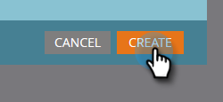

# Bygg en rapport om personprestanda med Mobile Platform-kolumner {#build-a-people-performance-report-with-mobile-platform-columns}

Följ de här stegen för att skapa en rapport om personprestanda med mobila plattformskolumner (iOS/Android).

## Skapa smarta mobillistor {#create-mobile-smart-lists}

1. Gå till **Marknadsföringsaktiviteter**.

   

1. Välj ett program.

   

1. Välj **Ny lokal resurs** under **Ny**.

   

1. Klicka på **Smart lista**.

   

1. Skriv ett namn och klicka på **Skapa**.

   

1. Hitta och dra filtret Öppen e-post till arbetsytan.

   

1. Ange e-postadress till **är valfri**.

   

1. Klicka på **Lägg till begränsning** och välj **Plattform**.

   

   >[!TIP]
   >
   >Vi använde filtret Öppen e-post i det här exemplet. Du kan också använda det klickade e-postfiltret på samma sätt som det har plattformsbegränsningen.

1. Ställ in plattformen på **iOS**.

   

   >[!NOTE]
   >
   >Minst en person måste ha öppnat ett av dina e-postmeddelanden på en iOS-enhet för att Marketos automatiska förslag ska kunna hitta det. Om det inte visas kan du skriva in det manuellt och spara.

   Skapa nu en andra smart lista för Android-plattformen. När det är klart går du vidare till nästa avsnitt.

## Skapa en rapport om personprestanda {#create-a-people-performance-report}

1. Under Marknadsföringsaktiviteter väljer du det program som innehåller de smarta listorna **iOS** och **Android**.

   

1. Välj **Ny lokal resurs** under **Ny**.

   

1. Klicka på **Rapport**.

   

1. Ange typen till **Personprestanda**.

   

1. Klicka på **Skapa**.

   

   Du klarar dig bra! Nu till nästa avsnitt.

## Lägg till smarta mobillistor som kolumner {#add-mobile-smart-lists-as-columns}

1. Klicka på **Inställningar** i den rapport du just skapade och dra sedan **Anpassade kolumner** till arbetsytan.

   

   >[!NOTE]
   >
   >Som standard tittar rapporten People Performance på de senaste 7 dagarna. Du kan ändra tidsramen genom att dubbelklicka på den.

1. Sök efter och markera de smarta listor som du skapade tidigare och klicka på **Använd**.

   

1. Klicka på **Rapport** för att köra rapporten och se dina data.

   

   Rätt coolt, eller hur? Snyggt gjort!

