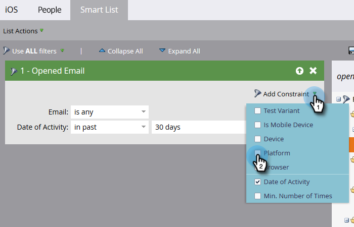

# Bygg en rapport om personprestanda med Mobile Platform-kolumner {#build-a-people-performance-report-with-mobile-platform-columns}

Följ de här stegen för att skapa en People Performance Report (rapport om personprestanda) med mobilplattformskolumner (iOS/Android).

## Skapa smarta mobillistor {#create-mobile-smart-lists}

1. Gå till **[!UICONTROL Marketing Activities]**.

   

1. Välj ett program.

   

1. Välj **[!UICONTROL New]** under **[!UICONTROL New Local Asset]**.

   

1. Klicka på **[!UICONTROL Smart List]**.

   

1. Skriv ett namn och klicka på **[!UICONTROL Create]**.

   

1. Hitta och dra filtret [!UICONTROL Opened Email] till arbetsytan.

   

1. Ange e-post till **[!UICONTROL is any]**.

   

1. Klicka på **[!UICONTROL Add Constraint]** och välj **[!UICONTROL Platform]**.

   

   >[!TIP]
   >
   >Vi använde filtret [!UICONTROL Opened Email] i detta exempel. Du kan också använda filtret [!UICONTROL Clicked Email] på samma sätt som med plattformsbegränsningen.

1. Ange [!UICONTROL Platform] till **[!UICONTROL iOS]**.

   

   >[!NOTE]
   >
   >Minst en person måste ha öppnat ett av dina e-postmeddelanden på en iOS-enhet för att Marketo automatiska förslag ska kunna hitta det. Om det inte visas kan du skriva in det manuellt och spara.

   Skapa nu en andra smart lista för Android-plattformen. När det är klart går du vidare till nästa avsnitt.

## Skapa en rapport om personprestanda {#create-a-people-performance-report}

1. Under Marknadsföringsaktiviteter väljer du det program som innehåller de smarta listorna **[!UICONTROL iOS]** och **[!UICONTROL Android]**.

   

1. Välj **[!UICONTROL New]** under **[!UICONTROL New Local Asset]**.

   

1. Klicka på **[!UICONTROL Report]**.

   

1. Ange typ till **[!UICONTROL People Performance]**.

   

1. Klicka på **[!UICONTROL Create]**.

   

   Du klarar dig bra! Nu till nästa avsnitt.

## Lägg till smarta mobillistor som kolumner {#add-mobile-smart-lists-as-columns}

1. Klicka på **[!UICONTROL Setup]** i den rapport du just skapade och dra sedan **[!UICONTROL Custom Columns]** till arbetsytan.

   

   >[!NOTE]
   >
   >Som standard tittar rapporten People Performance på de senaste 7 dagarna. Du kan ändra tidsramen genom att dubbelklicka på den.

1. Sök efter och markera de smarta listor som du skapade tidigare och klicka på **[!UICONTROL Apply]**.

   

1. Klicka på **[!UICONTROL Report]** om du vill köra rapporten och se dina data.

   

   Rätt coolt, eller hur? Snyggt gjort!
