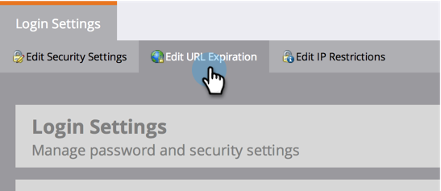

# Ändra förfallotid för URL:er i rapportmeddelanden {#change-the-expiration-time-for-urls-in-report-emails}

>[!NOTE]
>
>**Administratörsbehörigheter krävs**

Länkar i prenumerationsmeddelanden för rapporter upphör att gälla efter tre dagar. Följ de här stegen för att ändra förfallotiden för länkarna.

1. Under **Admin** klickar du på **Inloggningsinställningar**.

   

1. Klicka på knappen **Redigera URL-förfallodatum**.

   

1. Välj i listrutan hur många dagar innan länken upphör att gälla. Klicka på **Spara**.

   

   Cool, du har redigerat e-postlänkens förfalloinställningar.

   >[!NOTE]
   >
   >Kom ihåg att dessa bara gäller länkar i rapporter och varningar, inte marknadsföring via e-post.
