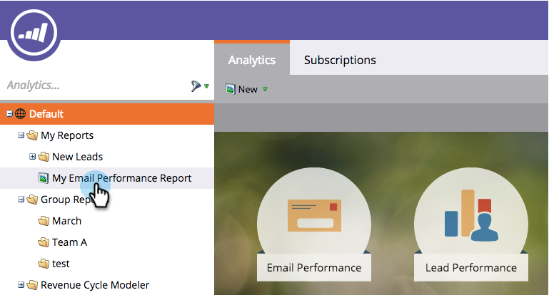

# Klona en rapport till grupprapporter {#clone-a-report-to-group-reports}

Alla rapporter i **Mina rapporter **är bara synliga för dig. Vad händer om du vill göra rapporten tillgänglig för alla andra? Så här kan du göra:

1. I **Analyser** klickar du på önskat [sparad rapport](/help/marketo/product-docs/reporting/basic-reporting/creating-reports/save-a-report.md).

   

   >[!NOTE]
   >
   >En sparad rapport kan också klonas till **Grupprapporter** genom att dra rapporten till mappen.

1. Klicka **Rapportåtgärder** och markera **Klonrapport**.

   

1. Klicka på **Klona till** och välj gruppen. Välj **Mapp**.

   

1. **Namn** rapporten och klicka på **Klona**.

   

   Häftig! Din rapport visas nu i **Grupprapporter**.

   
