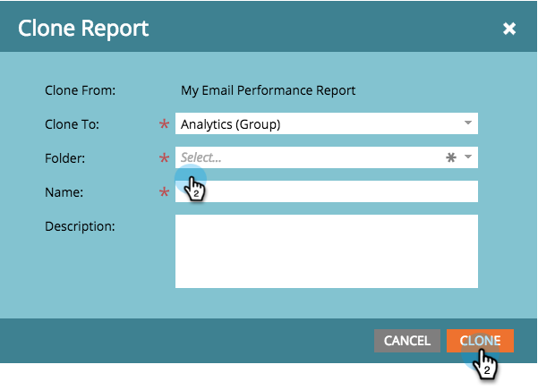

# Klona en rapport till grupprapporter {#clone-a-report-to-group-reports}

Alla rapporter i **Mina rapporter **är bara synliga för dig. Vad händer om du vill göra rapporten tillgänglig för alla andra? Så här kan du göra:

1. Klicka på önskad [sparad rapport](../../../../product-docs/reporting/basic-reporting/creating-reports/save-a-report.md)i området **Analytics **.
1. 

   >[!NOTE]
   >
   >En sparad rapport kan också klonas till **Grupprapporter **genom att dra rapporten till mappen.

1. Klicka på **Rapportåtgärder **och välj **Klonrapport**.

   

1. **Klona till** en **analysgrupp** och välj en **mapp**.

   

1. **Namnge** rapporten och klicka på **Klona**.

   

   Häftig! Din rapport visas nu i **grupprapporter.**

   

