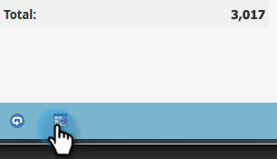

# Öka detaljnivån i en rapport om personprestanda {#drill-down-in-a-people-performance-report}

Gå ned i en rapport om personprestanda om du vill se ytterligare personinformation.

1. Klicka på fliken **Rapport** om du vill visa en befintlig rapport.

   

1. Markera en rad i rapporten som du vill veta mer om.

   

1. Klicka på **Detaljerad**.

   

1. I popup-fönstret **Detaljnivå** väljer du det attribut du vill gå ned till. Klicka sedan på **Granska nedåt**.

   

1. Snyggt jobb! Detaljrapporten öppnas på en ny flik. Nu kan du utforska den nya rapporten.

   >[!TIP]
   >
   >Om du inte ser någon ny rapportflik öppen kan det bero på att webbläsaren blockerar popup-fönster. Ändra webbläsarinställningarna så att de tillåts.

   

1. Om du vill spara dina resultat (valfritt) klickar du på ikonen **Exportera** längst ned till vänster.

   
