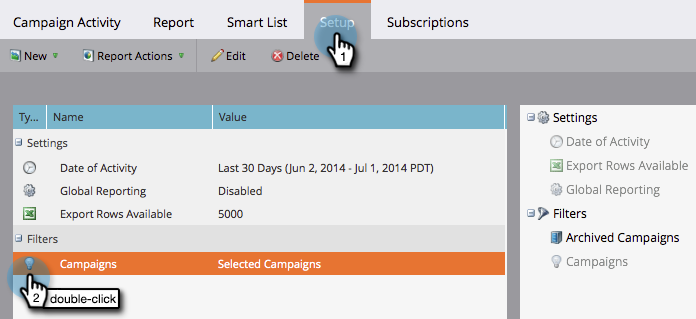

# Filtrera en kampanjaktivitetsrapport {#filter-a-campaign-activity-report}

Fokusera på [Kampanjaktivitetsrapport](/help/marketo/product-docs/reporting/basic-reporting/report-types/campaign-activity-report.md)på specifika [smarta kampanjer](/help/marketo/product-docs/core-marketo-concepts/smart-campaigns/creating-a-smart-campaign/understanding-batch-and-trigger-smart-campaigns.md).

>[!NOTE]
>
>Det går inte att filtrera resurser i rapporter i satellitläge (ikonen&quot;Öppna i ett nytt fönster&quot; till höger om sidan med resursinformation).

1. Gå till **Marknadsföringsaktiviteter** (eller **Analyser**) och välj din kampanjaktivitetsrapport.

   

1. Klicka på **Inställningar** och dubbelklicka **Kampanjer**.

   

1. Välj mappar och smarta kampanjer som ska inkluderas i rapporten. Klicka **Använd**.

   

   >[!TIP]
   >
   >Om du väljer en mapp innehåller rapporten allt som finns i mappen när rapporten körs.

1. Du är klar! Klicka på **Rapport** flik att se _just_ de valda smarta kampanjerna i rapporten.

   

>[!MORELIKETHIS]
>
>[Resultatrapport för e-postkampanj](/help/marketo/product-docs/reporting/basic-reporting/report-types/campaign-email-performance-report.md)
