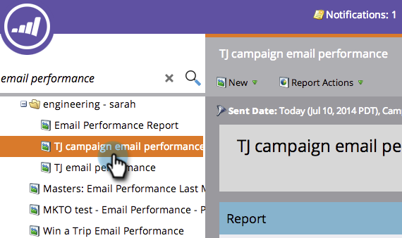
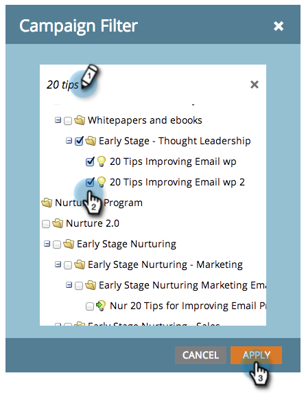

# Filtrera resurser i en e-postrapport för kampanj {#filter-assets-in-a-campaign-email-reports}

Fokusera på [Kampanjens e-postprestanda](/help/marketo/product-docs/reporting/basic-reporting/report-types/campaign-email-performance-report.md) rapport om specifika [smarta kampanjer](/help/marketo/product-docs/core-marketo-concepts/smart-campaigns/creating-a-smart-campaign/understanding-batch-and-trigger-smart-campaigns.md) i dina program (&quot;lokala resurser&quot;) eller på de som har arkiverats.

1. Gå till **Analyser** (eller **Marknadsföringsaktiviteter**).

   

1. Välj din rapport om e-postprestanda.

   

1. Klicka på **Inställningar** och dra över ett filter.

   

   * **Kampanjer**: Aktiva smarta kampanjer i ditt Marketo-konto.
   * **Arkiverade kampanjer**: Inaktiva, pensionerade smarta kampanjer.

1. Välj mappar och smarta kampanjer som ska inkluderas i rapporten.

   

   >[!TIP]
   >
   >Om du väljer en mapp innehåller rapporten allt som finns i mappen när rapporten körs.

1. Du är klar! Klicka på **Rapport** för att se din filtrerade rapport.

   

   >[!MORELIKETHIS]
   >
   >[Resultatrapport för e-postkampanj](/help/marketo/product-docs/reporting/basic-reporting/report-types/campaign-email-performance-report.md)
   >[Filtrera resurser i en e-postrapport](/help/marketo/product-docs/reporting/basic-reporting/report-activity/filter-assets-in-an-email-report.md)
