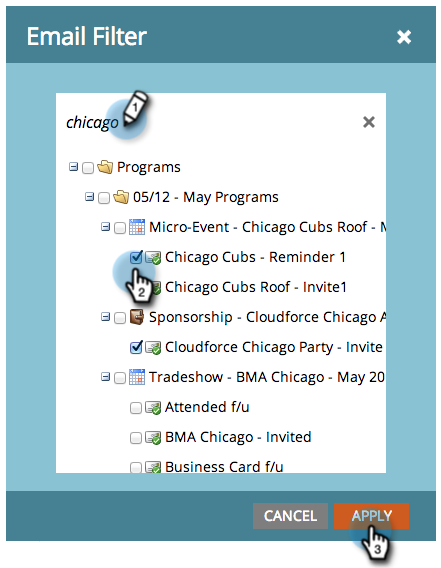

# Filtrera resurser i en e-postrapport {#filter-assets-in-an-email-report}

Fokusera på din rapport om [e-postprestanda](../../../../product-docs/email-marketing/email-programs/email-program-data/email-performance-report.md) eller [e-postlänksprestanda](../../../../product-docs/email-marketing/email-programs/email-program-data/email-link-performance-report.md) i dina program (lokala resurser), på e-postmeddelanden i Design Studio (globala resurser) eller på e-postmeddelanden som har arkiverats.

1. Gå till **Analytics** (eller **Marketing Activity**).

   

1. Välj din e-postrapport.

   

1. Klicka på fliken **Inställningar** och dra över ett filter.

   

   * **Design Studio-mejl**: Globala resurser som hanteras i Design Studio.
   * **Marknadsföringsaktiviteter - e-post**: Lokala resurser i program på fliken Marknadsföringsaktiviteter.
   * **Arkiverade e-postmeddelanden**: Inaktiva, pensionerade e-postmeddelanden.

1. Välj mappar och specifika e-postmeddelanden som ska inkluderas i rapporten.

   

   >[!TIP]
   >
   >Om du väljer en mapp innehåller rapporten allt som finns i mappen när rapporten körs.

1. Du är klar! Klicka på fliken **Rapport** för att visa den filtrerade rapporten.

   

>[!MORELIKETHIS]
>
>* [Filtrera resurser i en e-postrapport för kampanj](filter-assets-in-a-campaign-email-reports.md)

>

>[!NOTE]
>
>**Djupdykning**
>
>Lär dig allt om rapporter i [Grundläggande rapportering](http://docs.marketo.com/display/docs/basic+reporting).

