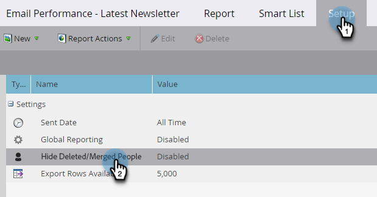

# Filtrera borttagna/sammanfogade poster i en e-postrapport {#filter-deleted-merged-records-in-an-email-performance-report}

Fokusera på din rapport om e-postprestanda i e-postmeddelanden i dina program (&quot;lokala resurser&quot;), på e-postmeddelanden i Design Studio (&quot;globala resurser&quot;) eller på e-postmeddelanden som har arkiverats.

>[!NOTE]
>
>Det går inte att filtrera resurser i rapporter i satellitläge (ikonen&quot;Öppna i ett nytt fönster&quot; till höger om sidan med resursinformation).

1. Gå till **Analytics** (eller Marketing Activity).

   

1. Välj din e-postprestandarapport.

   

1. Klicka på fliken **Inställningar** och välj **Dölj borttagna/sammanfogade personer**.

   

1. Klicka på listrutan, välj **Aktiverad** och klicka på **Spara**.

   

Du är klar! Klicka på fliken Rapport för att visa den filtrerade rapporten.
