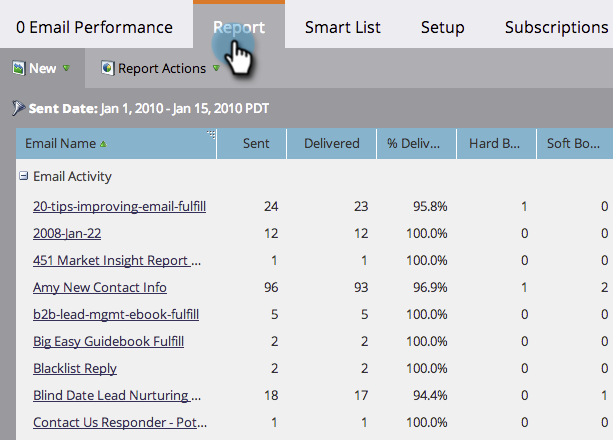

# E-postrapport, kampanjprestanda i flera arbetsytor {#report-email-campaign-performance-across-workspaces}

Aktivera Global Reporting om du vill inkludera data från alla dina Marketo [arbetsytor](/help/marketo/product-docs/administration/workspaces-and-person-partitions/create-a-new-workspace.md) i [E-postprestanda](/help/marketo/product-docs/email-marketing/email-programs/email-program-data/email-performance-report.md), [E-postlänksprestanda](/help/marketo/product-docs/email-marketing/email-programs/email-program-data/email-link-performance-report.md)och [Kampanjaktivitet](/help/marketo/product-docs/reporting/basic-reporting/report-types/campaign-activity-report.md) rapporter.

1. Gå till **Analyser** (eller **Marknadsföringsaktiviteter**).

   

1. Välj rapport.

   

1. Klicka på **Inställningar** och dubbelklicka **Global rapportering**.

   

1. Välj **Aktiverad**.

   

1. Det är allt! Klicka på **Rapport** om du vill visa data från alla arbetsytor.

   

   >[!MORELIKETHIS]
   >
   >[Filtrera resurser i en e-postrapport](/help/marketo/product-docs/reporting/basic-reporting/report-activity/filter-assets-in-an-email-report.md)
