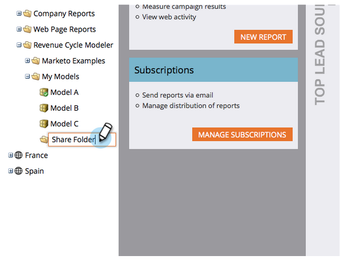
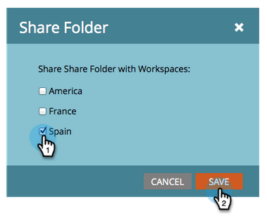

# Dela en modell över arbetsytor {#share-a-model-across-workspaces}

Marketo ger dig möjlighet att dela en eller flera modeller över arbetsytorna. Så här gör du.

>[!NOTE]
>
>**FYI**
>
>Marketo standardiserar nu språk för alla prenumerationer, så du kan se lead/leads i din prenumeration och person/personer på docs.marketo.com. Dessa termer betyder samma sak. det påverkar inte artikelinstruktionerna. Det finns andra förändringar också. [Läs mer](http://docs.marketo.com/display/DOCS/Updates+to+Marketo+Terminology).

1. Gå till **Analytics** -avsnittet.

   

1. Högerklicka på mappen **Mina modeller** och klicka på **Ny mapp**.

   

1. Namnge mappen.

   

1. Dra modellerna som du vill dela till **Dela mapp**.

   

1. Högerklicka på mappen och klicka på **Dela mapp**.

   

   >[!NOTE]
   >
   >
   >Genom att dela en modell med en annan arbetsyta kan dessa användare köra rapporter baserade på modellen.

1. Markera de arbetsytor som du vill dela mappen med och klicka på **Spara**.

   

Så enkelt är det! Nu kan personer från andra arbetsytor navigera i den delade modellen. Du kanske vill köra persontilldelning på den arbetsytan, se [Starta intäktscykelmodellen](https://community.marketo.com/MarketoArticle?id=kA050000000KyvQCAS) för mer information.
