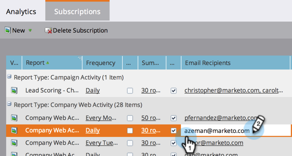
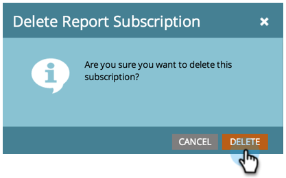

# Hantera rapportprenumerationer {#manage-report-subscriptions}

Konfigurera och ta bort rapportprenumerationer.

1. Gå till området **Analytics**.

   

1. Klicka på fliken **Prenumerationer**.

   

   På den här sidan visas prenumerationerna på alla rapporter på ditt konto, grupperade efter [rapporttyp](../../../../product-docs/reporting/basic-reporting/report-types/report-type-overview.md). Detta inkluderar [prenumerationer på grundläggande rapporter](subscribe-to-a-basic-report.md) och på rapporter i [Intäktscykelutforskaren](http://docs.marketo.com/display/docs/revenue+cycle+analytics).

   >[!TIP]
   >
   >Du kan också hantera prenumerationer på en enskild rapport i **Marknadsföringsaktiviteter**. Markera rapporten och klicka på fliken **Prenumerationer**.

   Om du vill ändra hur ofta en rapport skickas via e-post klickar du på fältet Frekvens och väljer ett nytt alternativ i listrutan.

   

1. Om du vill ändra e-postadresserna i en prenumeration klickar du på fältet **E-postmottagare** och redigerar e-postadresserna.

   

   >[!TIP]
   >
   >
   >    
   >    
   >    * Använd kommatecken mellan e-postadresser.
   >    * Om du vill spara redigeringarna klickar du i ett område *utanför* prenumerationslistan.

   Du kan också:

   * Klicka på knappen **Visa** för att öppna en rapport.
   * Avmarkera kryssrutan **Aktiv** om du vill inaktivera prenumerationen.
   * Klicka och redigera fältet **Sammanfattning** om du vill ändra hur många förhandsgranskningsrader som visas i e-postmeddelandet.
   * Avmarkera kryssrutan **Excel** om du vill skicka rapportsammanfattningar utan kalkylbladsbilagan.
   * Klicka på knappen **Skicka** om du vill skicka rapportens e-post direkt.

1. Om du vill ta bort en prenumeration helt markerar du raden och klickar på **Ta bort prenumeration**.

   

1. Bekräfta din avsikt att ta bort prenumerationen.

   

   >[!NOTE]
   >
   >**Relaterade artiklar**
   >
   >    
   >    
   >    * [Prenumerera på en grundläggande rapport](subscribe-to-a-basic-report.md)
   >    * [Prenumerera på en rapport om skatteutforskaren](../../../../product-docs/reporting/revenue-cycle-analytics/revenue-explorer/subscribe-to-a-revenue-explorer-report.md)

   Läs mer i [Basic Reporting](http://docs.marketo.com/display/docs/basic+reporting) och [Revenue Cycle Explorer](http://docs.marketo.com/display/docs/revenue+cycle+analytics) deep dives.

