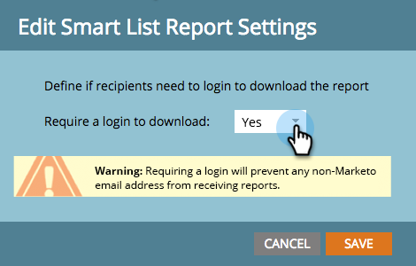

# Skydda inställningen för prenumerationsadministratör {#secure-the-subscription-admin-setting}

>[!NOTE]
>
>**Administratörsbehörigheter krävs**

En administratör kan välja att kräva inloggning för att visa en rapport.

1. Klicka på **Admin** och **Inloggningsinställningar**.

   

1. Klicka på **Redigera** för Rapportinställningar för smart lista.

   

1. Välj **Ja** om du vill ha en inloggning för att hämta rapporter.

   

   >[!CAUTION]
   >
   >Om du behöver logga in för att hämta rapporter och inte har tillgång till Marketo får du inga e-postmeddelanden med smarta listrapporter. Detta gäller befintliga och framtida prenumerationer.

