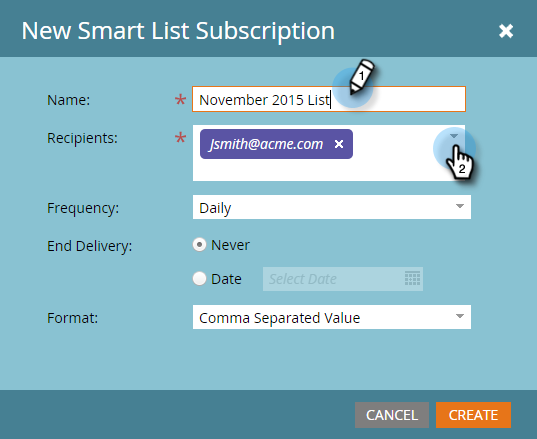
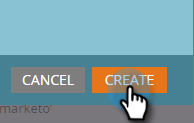

# Prenumerera på en smart lista {#subscribe-to-a-smart-list}

Att prenumerera på smarta listor är ett bra sätt att hålla reda på personer, med rapporter som skickas direkt till din inkorg.

Du kan skapa en prenumeration på en smart lista på två olika platser:

* Marknadsföringsaktiviteter
* Databas

Prenumerationer använder den fullständiga listan över personer när prenumerationen körs.

Prenumerationer lever där din smarta lista finns, i marknadsföringsaktiviteter eller i databasen.

Du kan skapa flera prenumerationer från samma smarta lista.

Prenumerationer är specifika för arbetsytan. Den här listan över prenumerationer finns till exempel på en annan arbetsyta än de som visas i resten av den här artikeln:

>[!NOTE]
>
>Du är begränsad till 100 prenumerationer och högst 100 000 personer per prenumeration, över arbetsytor och i Marketo-instanser. Om den smarta listan innehåller fler än 100 000 namn kommer Marketo att köra prenumerationen för de första 100 000.

## Skapa en prenumeration på en smart lista {#create-a-smart-list-subscription}

1. Gå till **databas** eller **marknadsföringsaktiviteter**.

   

1. Välj den smarta lista som du vill skapa en prenumeration för. Klicka på **Lista åtgärder** och välj** Ny prenumeration på Smart List**.

   

1. Ge din prenumeration ett **namn** och välj eller ange e-postadresserna till **mottagarna**.

   

1. Klicka på **Frekvens** och välj en frekvens.

   ** 

   **

1. Ange **End Delivery **date. Du kan välja **Aldrig** eller ett kalenderdatum.

   

1. Klicka på **Format** och välj i listan.

   

1. Klicka på **Skapa**.

   

1. Din nya smarta listprenumeration visas högst upp i listan på fliken Prenumerationer. Klicka på **Skicka** om du vill skicka nu och inte vänta tills den schemalagda e-postleveransen.

   

1. Vi rekommenderar att du avmarkerar kryssrutan Aktiv för att inaktivera en prenumeration på en smart lista om ingen prenumererar på den.

   

   Det var lätt, eller hur?

## E-postmeddelande {#email-message}

Mottagarna får ett e-postmeddelande med möjlighet att ladda ned rapporten samt en länk direkt till listan i Marketo-instansen. Hämtningslänken upphör om fyra dagar.

>[!NOTE]
>
>Om inställningen för [säker prenumerationsadministration](secure-the-subscription-admin-setting.md) är **Ja** kan bara personer med åtkomst till Marketo-instansen hämta rapporten.

Om det finns 0 personer i en rapport får mottagarna fortfarande ett e-postmeddelande. I e-postmeddelandet står det dock bara att det inte finns några personer att rapportera.

>[!NOTE]
>
>När du ändrar ett smart listfilter som du har baserat en prenumeration på uppdateras även rapporten.

E-postmeddelandet innehåller även ytterligare information om de filter som används för att skapa listan.

## Ta bort en prenumeration {#delete-a-subscription}

Om du vill ta bort en prenumeration markerar du den på prenumerationsfliken och klickar på Ta bort prenumeration.

>[!MORELIKETHIS]
>
>* [Redigera en prenumeration på en smart lista](edit-a-smart-list-subscription.md)
>* [Skydda inställningen för prenumerationsadministration](secure-the-subscription-admin-setting.md)

>

