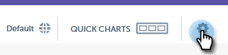
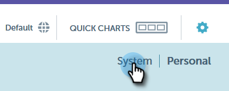

# Anpassade Dimensioner för e-postinsikter {#custom-dimensions-for-email-insights}

Alla Marketo standardmått ingår, men du kan lägga till upp till 10 anpassade dimensioner. Anpassade dimensioner består av segmenteringar och programtaggar. Så här lägger du till dem.

>[!NOTE]
>
>**Administratörsbehörigheter krävs**

>[!CAUTION]
>
>Anpassade dimensioner **inte** tas bort eller ersätts, så välj 10 noggrant.

1. I E-postinsikter klickar du på kugghjulsikonen i det övre högra hörnet på sidan.

   

1. Klicka **System**.

   

1. Klicka på **+** nästa **Lägg till dimension**.

   

1. Börja markera!

   

   >[!NOTE]
   >
   >**Per publik**: Visar alla godkända segment (från databasen)
   >
   >**Efter innehåll**: Visar alla programtaggar
