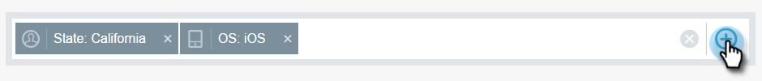
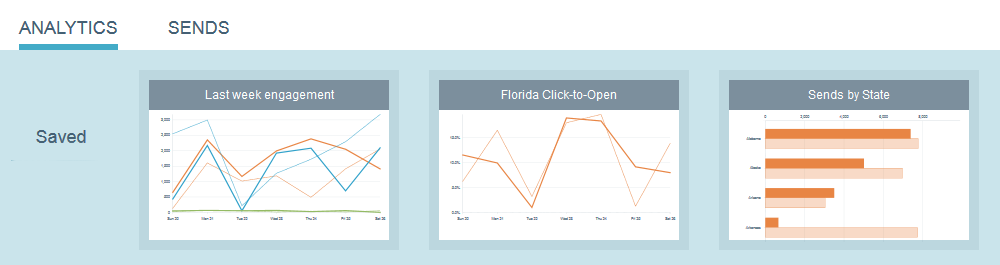

# Översikt över e-postinsikter {#email-insights-overview}

E-postinsikter ger kraftfulla insikter från historiska data för e-postmarknadsförare. Det består av två separata men associerade avsnitt: Analyser och utskick.

Om du vill få tillgång till e-postinsikter klickar du bara på dess panel i My Marketo (eller på startskärmen i Analytics).   

>[!NOTE]
>
>Som standard visas data för alla arbetsytor som du har tillgång till. Du kan avmarkera arbetsytor som du inte vill visa. Dina val kommer att sparas i framtiden.

## Analyser {#analytics}

Använd [Analytics](email-insights-analytics-overview.md) för att utforska sammanställda tidsseriedata för e-postleverans och engagemangsmått.

**Filter **

Använde avancerade [filter](filtering-in-email-insights.md) för att bryta ned resultaten efter publik, innehåll eller plattform. Samma filter gäller för både Analytics och Send.

**Snabbdiagram**

[Snabbdiagram](email-insights-quick-charts.md) är miniatyrbilder som du skapar och sparar och som ger en snabb vy av diagram som är viktiga för dig.

## Skickar {#sends}

Granska egenskaperna för den senaste e-postkommunikationen på sidan [Skicka](email-insights-sends-overview.md) .

**Mått**

Klicka på mätfälten för att omvandla färgerna till siffror.

>[!NOTE]
>
>Det kan ta upp till 8 timmar för data att spegla i e-postinsikter.

## Anpassade Dimensioner {#custom-dimensions}

Alla vanliga Marketo-dimensioner inkluderas, men du kan lägga till upp till 10 anpassade dimensioner. [Anpassade dimensioner](custom-dimensions-for-email-insights.md) består av segmenteringar och programtaggar.

>[!NOTE]
>
>**Relaterade artiklar**
>
>* [Översikt över analys av e-postinsikter](email-insights-analytics-overview.md)
>* [E-postinsikter - skicka översikt](email-insights-sends-overview.md)

>

