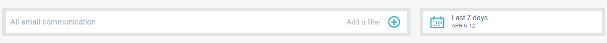
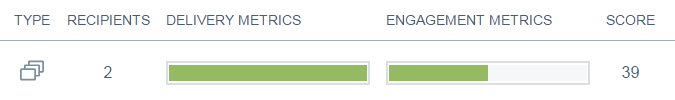
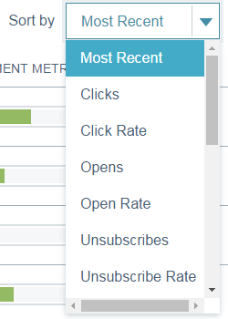

# E-postinsikter - skicka översikt {#email-insights-sends-overview}

Granska egenskaperna för den senaste e-postkommunikationen på sidan Skicka.

Använd [filtrering](filtering-in-email-insights.md) för att ange vilka e-postmeddelanden du vill se.

Till höger på sidan finns det flera uppgifter om dina skickade e-postmeddelanden.

**Typ** anger vilken typ av tillgång som används.\
**Mottagarnummer** är hur många personer som har fått e-postmeddelandet.\
**Delivery Metrics** ger er en snabb bild av hur många e-postmeddelanden som har levererats, väntar eller har studsat.\
**Med Engagement Metrics** får du en snabb överblick över hur många mottagare som har öppnat, klickat in och avslutat en prenumeration via e-post.\
**Score** är e-postens [Engagement Score](../../../product-docs/email-marketing/drip-nurturing/reports-and-notifications/understanding-the-engagement-score.md).

Som standard sorteras dina e-postmeddelanden efter de senaste, men du kan sortera dem efter alla tillgängliga mätvärden.

>[!NOTE]
>
>E-postmeddelanden listas efter program- eller kampanjnamn (överst) och e-postresursnamn (nederst).

Om du vill visa din e-poststatus i Analytics (Analyser) håller du muspekaren bredvid Score (Resultat) och klickar på diagramikonen.   

Häftiga saker!

>[!MORELIKETHIS]
>
>[Översikt över analys av e-postinsikter](email-insights-analytics-overview.md)

