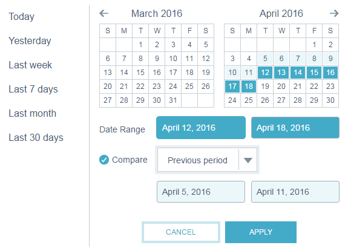

# Filtrera i e-postinsikter {#filtering-in-email-insights}

I e-postinsikter finns det olika sätt att filtrera data.

## E-postinsikter {#email-insights}

Klicka på + för att börja lägga till filter. Lägg till så många du vill.

Om du har fler än ett filter i samma kategori sammanfogas och visas mängden.

Om du vill se vilka filter du har använt klickar du bara på filtret. Du kan till och med lägga till mer där.

Du kan också lägga till fler typer av filter.

Och ännu fler filter!

Diagrammet ändras efter att varje filter har använts.

Om du vill ta bort en kategori klickar du på dess X.

Om du vill ta bort alla filter klickar du på X i slutet av filterfältet.

Använd datumintervall för datumspecifika data.

Välj bland vanliga förinställda datumintervall, välj specifika datum och använd till och med föregående period för jämförelse.

>[!NOTE]
>
>Datumintervall gäller för både sidan Analytics (Analyser) och sidan Send (Skickar). Alternativet **Jämför** gäller dock bara Analytics-sidan.

## Kontobaserad marknadsföring {#account-based-marketing}

Om du använder [kontobaserad marknadsföring](http://docs.marketo.com/display/DOCS/Account+Based+Marketing+Overview)finns det filter särskilt för dig.

