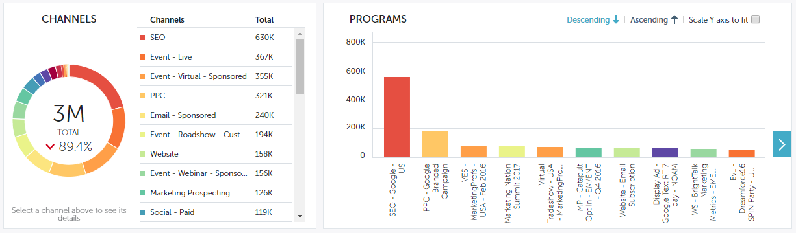

# Filtrera i Performance Insights {#filtering-in-performance-insights}

Filtrera enkelt data för att hämta specifik information.

Klicka på + för att börja lägga till filter.

>[!NOTE]
>
>För närvarande är anpassade attribut endast tillgängliga i filter för kunder som har [RCA](http://docs.marketo.com/x/lwIk) aktiverat.

Om du klickar på en kategori visas flera underkategorier.

Välj en underkategori och sök efter/välj ett värde.

Diagrammen uppdateras med de valda filtren.

Du kan lägga till fler filter genom att följa samma steg.

Du kan ta bort ett filter när som helst genom att klicka på X:et bredvid det. Ta bort alla filter samtidigt genom att klicka på X längst till höger.

## Tillgängliga filter {#available-filters}

<table> 
 <tbody> 
  <tr> 
   <td colspan="1"><strong>ABM-kontolista</strong></td> 
   <td colspan="1">Om du använder Marketo ABM synkroniseras alla dina kontolistor till MPI och visas via filtret ABM-kontolista. Du kan välja en kontolista om du vill filtrera resultaten till dessa konton.<a href="https://docs.marketo.com/display/public/DOCS/Account-Based+Web+Marketing+with+ABM" rel="nofollow">Läs mer om kontolistor för ABM.</a></td> 
  </tr> 
  <tr> 
   <td colspan="1"><strong>Namngivet ABM-konto</strong></td> 
   <td colspan="1">Om du använder Marketo ABM synkroniseras alla dina namngivna konton till MPI och visas via filtret"ABM Named Account". Du kan välja ett namngivet konto för att filtrera resultaten till dessa konton.<a href="http://docs.marketo.com/x/eaCt" rel="nofollow">Läs mer om ABM-namngivna konton.</a></td> 
  </tr> 
  <tr> 
   <td colspan="1"><strong>Anpassade attribut</strong></td> 
   <td colspan="1">
De här bestäms av dig. Alla fält som <a href="http://docs.marketo.com/display/public/DOCS/Enabling+Custom+Field+Sync+for+Revenue+Cycle+Analytics" rel="nofollow">du aktiverar</a> för affärsmöjlighetsanalysen kan filtreras i Performance Insights.
</td> 
  </tr> 
  <tr> 
   <td colspan="1">
<strong>Investeringsperiod</strong>
</td> 
   <td colspan="1">
Tidsram för programkostnad.
</td> 
  </tr> 
  <tr> 
   <td colspan="1">
<strong>Typ av affärsmöjlighet</strong>
</td> 
   <td colspan="1">
Affärsmöjlighetstyp som konfigurerats för säljprojektsobjektet i Salesforce-konfigurationen (CRM).
</td> 
  </tr> 
  <tr> 
   <td>
<strong>Programtagg</strong>
</td> 
   <td>
Taggar används för att beskriva program. Ni kan skapa så många ni behöver, var och en med unika värden. <a href="https://docs.marketo.com/display/public/DOCS/Tags" rel="nofollow">Lär dig hur du arbetar med programtaggar här.</a>
</td> 
  </tr> 
  <tr> 
   <td><strong>Arbetsyta</strong></td> 
   <td>
Arbetsytor är separata områden i Marketo som innehåller marknadsföringsresurser, som: program, landningssidor, e-post med mera. <a href="https://docs.marketo.com/display/public/DOCS/Understanding+Workspaces+and+Person+Partitions" rel="nofollow">Läs mer om arbetsytor här.</a>
</td> 
  </tr> 
 </tbody> 
</table>

>[!NOTE]
>
>På kontrollpanelen för engagemang är endast programtaggar och arbetsytefilter tillgängliga.

