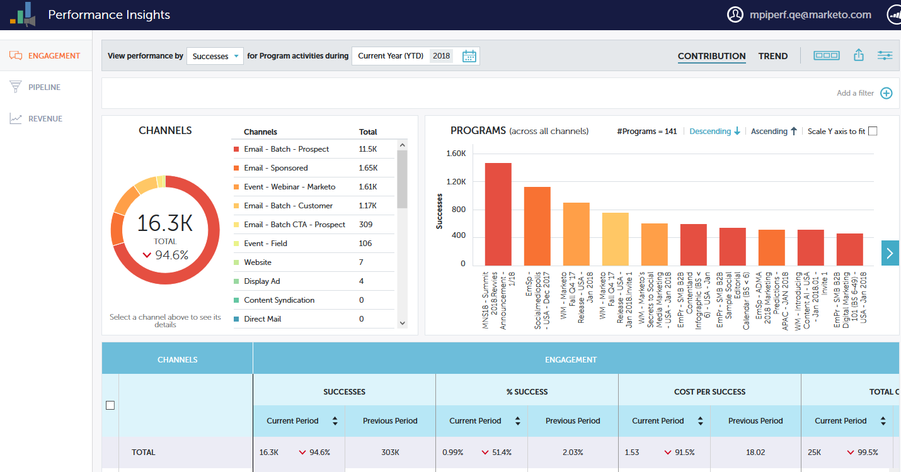

# Instrumentpaneler för prestandainsikter {#performance-insights-dashboards}

Läs mer om de tillgängliga instrumentpanelerna i MPI.

## Engagemang {#engagement}

Med kontrollpanelen för engagemang kan du mäta effektiviteten i dina program för att skaffa nya namn.

Mäta målgruppsengagemang

Välj **Framgångar** mätvärden för att mäta målgruppernas engagemang i era vårdsprogram. Success är ett mått på meningsfull interaktion i Marketo.

Syftet med ett program är att skapa en meningsfull interaktion med personen eller den potentiella kunden. Lyckade markeras när en person når den status som uppnår det målet. Det kan vara att delta i ett webbinarium, klicka på en länk i ett e-postmeddelande eller fylla i ett webbformulär. Hur bra det är varierar beroende på programkanalen.

>[!NOTE]
>
>I ett webbinarium kan det finnas flera statusar, som: Inbjuden, registrerad och anmäld. Inbjudna eller registrerade är inte meningsfulla interaktioner eftersom folk egentligen inte tittar på webbinariet. I det här fallet anses det som lyckat.

Mäta nytt namnförvärv

Välj **Nya namn** mätvärden för att mäta effektiviteten i era nya program för förvärv av namn.

>[!NOTE]
>
>Alla program måste vara konfigurerade för att ange förvärvsprogrammet och anskaffningsdatumet för leads för att den här instrumentpanelen ska ge bästa resultat.

## Pipeline {#pipeline}

Panelen Pipeline visar kanalprestanda med hjälp av första-touch- och multitouch-mått.

<table> 
 <tbody> 
  <tr> 
   <td>
<strong>Nya möjligheter</strong>
</td> 
   <td>
Den del av krediten som programmet fick för att påverka skapandet av nya möjligheter. Det kan vara en bråkdel om flera leads är inblandade.
</td> 
  </tr> 
  <tr> 
   <td>
<strong>Pipeline skapad</strong>
</td> 
   <td>
Den del av krediten (i penningvärde) som programmet fick för att påverka skapandet av möjligheter. Det kan vara en bråkdel av det totala antalet leads.
</td> 
  </tr> 
  <tr> 
   <td>
<strong>Öppen pipeline</strong>
</td> 
   <td>
Den del av krediten (i penningvärde) som programmet fick för att påverka skapandet av möjligheter som fortfarande är öppna. Det kan vara en bråkdel av det totala antalet leads.
</td> 
  </tr> 
  <tr> 
   <td>
<strong>Förväntad intäkt</strong>
</td> 
   <td>
Den del av krediten (i penningvärde) som programmet fick för att påverka skapandet av möjligheter. Förväntad intäkt är sannolikheten för affärsmöjligheten multiplicerad med värdet för affärsmöjligheten. Det kan vara en bråkdel om flera leads är inblandade.
</td> 
  </tr> 
  <tr> 
   <td>
<strong>Kostnad per affärstillfälle skapad</strong>
</td> 
   <td>
Den del av kostnaden för programmet som påverkade nya möjligheter dividerat med det totala antalet nya möjligheter som skapats.
</td> 
  </tr> 
  <tr> 
   <td>
<strong>Pipeline skapad till kostnadsförhållande</strong>
</td> 
   <td>
Den del av krediten som ett program fick för att påverka skapandet av nya möjligheter dividerat med den del av kostnaden för det program som påverkade skapandet av möjligheter.
</td> 
  </tr> 
 </tbody> 
</table>

## Intäkter {#revenue}

Instrumentpanelen Intäkter visar kanalprestanda med hjälp av statistik för första beröringen och multitouch.

<table> 
 <tbody> 
  <tr> 
   <td>
<strong>Vunna affärsmöjligheter</strong>
</td> 
   <td>
Den del av krediten som ett program tog emot för att påverka en vunnen affärsmöjlighet.
</td> 
  </tr> 
  <tr> 
   <td>
<strong>Vinst på intäkt</strong>
</td> 
   <td>
Andelen kredit (i penningvärde) som tagits emot för att påverka en vunnen möjlighet.
</td> 
  </tr> 
  <tr> 
   <td>
<strong>Kostnad per affärsmöjlighet vunnen</strong>
</td> 
   <td>
Den del av kostnaden för programmet som påverkade nya möjligheter dividerat med det totala antalet nya möjligheter som skapats.
</td> 
  </tr> 
  <tr> 
   <td>
<strong>Intäkter vunna till kostnadskvot</strong>
</td> 
   <td>
Andelen kredit (i penningvärde) som erhållits för att påverka en vunnen möjlighet dividerat med den del av kostnaden för programmet som påverkade nya möjligheter.
</td> 
  </tr> 
 </tbody> 
</table>
