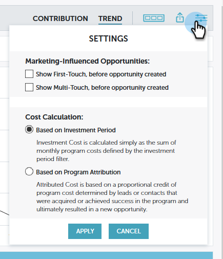
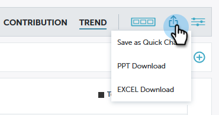

# Performance Insights - översikt {#performance-insights-overview}

Marketo Performance Insights hjälper er att optimera er kanalmix för maximal effektivitet och identifiera långsiktiga trender för att hitta enhetliga vinnande strategier.

>[!NOTE]
>
>**Tillgänglighet**
>
>Alla kunder har inte funktionen Performance Insights. Kontakta din Customer Success Manager om du vill ha mer information.

Performance Insights läser in data från (upp till) de senaste 24 månaderna. Detta inkluderar aktuella data från år till datum samt föregående års data. Den 31 januari 2019 läser till exempel MPI in data från den månaden och varje månad från 2018. Den 31 december 2019 kommer MPI att läsa in data från varje månad under 2019 och 2018.

Om du vill få åtkomst till Performance Insights klickar du på ikonen på startskärmen för Analytics.

## Bidrag {#contribution}

Utvärdera Marketing:s [bidrag till](http://docs.marketo.com/x/QAvG)intäkterna som en funktion av kundvärvning, påverkan, konvertering och även installerad bastillväxt.

Som standard återspeglar de data som visas prestanda efter engagemang. Du kan växla till prestanda genom Pipeline eller Intäkter genom att klicka på någon av dem.

## Trend {#trend}

Upptäck [långsiktiga trender](http://docs.marketo.com/x/QgvG) för att hitta enhetliga vinnande strategier.

## Inställningar {#settings}

Klicka på ikonen [Inställningar](http://docs.marketo.com/x/pIDS) på kontrollpanelerna Intäkter och Pipeline för att ange ytterligare parametrar.

## Exportera data {#export-data}

Du kan exportera data och diagram i PowerPoint eller Excel. Du kan också spara dem som ett [snabbdiagram](https://docs.marketo.com/x/iRLG).

>[!NOTE]
>
>Exportera data till Excel för att visa data som är tillgängliga för alla kanaler (inte bara de tio översta). PPT-exporten kommer att vara WYSIWYG (utdata kommer att efterlikna det du ser på skärmen).

