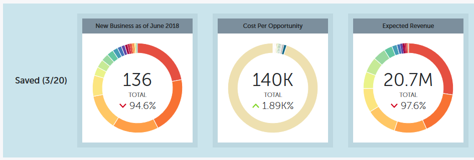

# Prestandainsikter, snabbdiagram {#performance-insights-quick-charts}

Snabbdiagram är miniatyrbilder som du anpassar och sparar, vilket ger en snabb vy av diagram som du använder mest.

## Skapa ett nytt snabbdiagram {#create-a-new-quick-chart}

Snabbdiagram härleds från data som du anger. I det här exemplet väljer vi: **nya affärsmöjligheter (första kontakten), typ av affärsmöjlighet = ny affärsverksamhet, aktuellt år** till dato.

1. Klicka på datumfiltret och välj **Aktuellt år (hittills i år)**.

   

1. Klicka på **+** och välj villkor.

   

1. Diagrammet uppdateras för att återspegla de filter du har valt.

   

1. Klicka på ikonen Exportera och välj **Spara som snabbdiagram**.

   

1. Ge snabbdiagrammet ett namn och klicka på **Spara**.

   

Ditt snabbdiagram är nu tillsammans med de andra.

>[!NOTE]
>
>Du kan ha upp till 20 snabbdiagram. De kan tas bort och ersättas.

## Visa befintliga snabbdiagram {#view-existing-quick-charts}

1. Om du vill visa dina befintliga snabbdiagram klickar du bara på **snabbdiagramsikonen** .

   

## Ta bort ett snabbdiagram {#delete-a-quick-chart}

Följ de här enkla stegen om du vill ta bort ett snabbdiagram.

1. Klicka på ikonen **Snabbdiagram** .

   

1. Håll pekaren över det önskade diagrammet, men klicka inte på det. När du hovrar visas ett X. Klicka på **X**.

   

1. Klicka på **Ta bort**.

   

