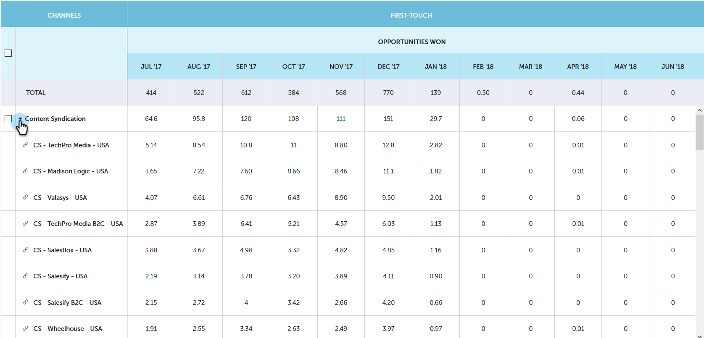

# Prestandainsikter, trendöversikt {#performance-insights-trend-overview}

Trend visar kanalprestanda för en tidsperiod.

Klicka på fliken **Trend** för att komma åt den här vyn.

## Trend {#trend}

Välj det mätvärde som du vill visa prestandan efter. I det här exemplet tittar vi på möjligheter som vunnits via [First Touch](http://docs.marketo.com/display/DOCS/Understanding+Attribution).

Mätvärdena presenteras i två diagram: ring och linje.

Ringdiagrammet visar de tio viktigaste kanalerna för det mätresultat du valt.

Linjediagrammet visar kanalresultattrenden för det mätvärde du valde under de senaste 12 månaderna.

Markera en eller flera kanaler och kanaltrenden visas i linjediagrammet. Klicka på kanalen/kanalerna igen för att avmarkera.

Datarutnätet nedan fungerar som ett kalkylblad och visar alla tillgängliga trenddata för det mätvärde du valde de senaste 12 månaderna.

Utöka en kanal och se de tio viktigaste programmen, med de återstående programmen kombinerade.

>[!NOTE]
>
>Om du klickar i kryssrutan bredvid en kanal aktiveras/inaktiveras den i ringdiagrammet.

