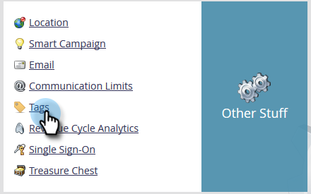

# Konfigurera prestandainsikter {#setting-up-performance-insights}

Följ stegen nedan för att konfigurera MPI.

## Inställningar för affärsmöjlighet {#opportunity-setup}

1. Klicka på **Admin**.

   

1. Klicka på **Intäktscykelanalys**.

   

   >[!NOTE]
   >
   >Om du inte har RCA måste du välja **Programanalys** för steg 2.

1. Klicka på **Redigera** under Attribution.

   

1. Attributinställningar visas.

   

   Om attribuering är explicit kontrollerar du att säljprojektskontaktrollen har fyllts i (antingen via slutpunkten för säljprojektsrollen eller via CRM-integrering).

   Om Attribution är implicit kontrollerar du att företagsfältet på leadet/kontakten är samma som kontonamnet för affärsmöjligheten.

   >[!NOTE]
   >
   >Se till att rätt fält fylls i för alla affärsmöjligheter:
   >
   >    
   >    
   >    * Affärsmöjlighet - belopp
   >    * Är stängd
   >    * Är vunnen
   >    * Skapad den (kan inte anges i ditt fall)
   >    * Stängt datum (detta kan inte anges i ditt fall)
   >    * Typ av affärsmöjlighet

## Programinställningar {#program-setup}

Uppdatera programkostnaderna i minst 12 månader. Du kan göra detta manuellt eller med program-API:t. I det här exemplet gör vi det manuellt.

1. Klicka på **Marknadsföringsaktiviteter**.

   

1. Hitta och välj program.

   

1. Klicka på fliken **Inställningar**.

   

1. Dra **Periodkostnad** till arbetsytan.

   

1. Ange programmånaden för minst 12 månader sedan och klicka på **OK**.

   

1. Ange periodkostnaden och klicka på **Spara**.

   

Granska sedan analysbeteendet för att ange om en viss kanal ska inkluderas i analysen. Ange analysbeteende (normal, inkluderande, operativ).

1. Klicka på **Admin**.

   

1. Klicka på **Taggar**.

   

1. Klicka på **+** för att utöka kanallistan.

   

1. Dubbelklicka på den önskade kanalen.

   

1. Klicka på listrutan **Analysbeteende** och välj önskat beteende.

   

1. Ange kriterier för framgång.

   

1. Klicka på **Spara**.

   

## Koppla programmet till personen {#tie-the-program-to-the-person}

1. Kontrollera att inköpsprogrammet och förvärvsdatumet har angetts för varje person i databasen för att First Touch Attribution ska fungera.
1. Se till att era program är framgångslägen för era medarbetare.

>[!NOTE]
>
>Ändringarna görs inte omedelbart. En nattetid krävs innan ändringarna träder i kraft.

