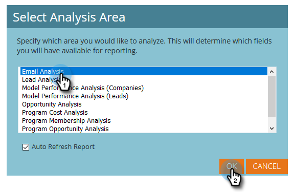
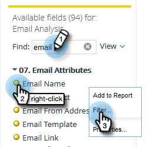
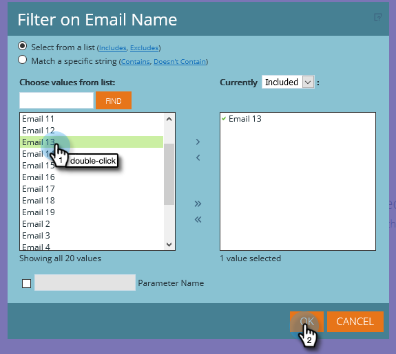

# Skapa en e-postanalysrapport som listar leads {#build-an-email-analysis-report-that-lists-leads}

Följ de här stegen för att skapa en e-postanalysrapport som visar alla leads som har skickats ett visst e-postmeddelande. Rapporten innehåller även Klicka- och Öppna-statistik.

>[!AVAILABILITY]
>
>Alla kunder har inte köpt den här funktionen. Kontakta din Customer Success Manager för mer information.

>[!NOTE]
>
>Datamotorn som stöder RCA för e-postanalys ignorerar fler än 12 klick per person om de kommer från samma e-post och kampanj. Ta hänsyn till detta när du jämför e-postanalysrapporter med vanliga Marketo Analytics-rapporter.

1. Starta **Intäktsutforskaren**.

   

1. Klicka **Skapa nytt** sedan **Rapport**.

   

1. Välj E-postanalys och klicka på **OK**.

   

1. Hitta den gula punkten för e-postnamnet, högerklicka på den och välj **Filter**.

   

1. Dubbelklicka på den e-postadress du vill använda i listan och klicka på **OK**.

   

1. Dra **E-postnamn** gul punkt till **Kolumner**.

   

   >[!TIP]
   >
   >Det finns många lead-/företagsattribut som du kan lägga till som kolumner, checka ut dem!

1. Hitta **Fullständigt namn** gul punkt och dra den till **Rader**.

   

1. Lägg till **Åtgärder** genom att dubbelklicka på dem.

   

>[!NOTE]
>
>Beroende på hur mycket data du har kan det ta en stund att uppdatera rapporten.

Uppdraget är klart!
