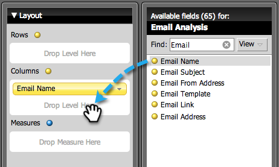

# Skapa en e-postanalysrapport som listar leads {#build-an-email-analysis-report-that-lists-leads}

>[!AVAILABILITY]
>
>
>Alla kunder har inte köpt den här funktionen. Kontakta din säljare för mer information.

Följ de här stegen för att skapa en e-postanalysrapport som visar alla leads som har skickats ett visst e-postmeddelande. Rapporten innehåller även Klicka- och Öppna-statistik. 1. Starta Intresseutforskaren.

1. Klicka på Ny rapport.

   

1. Markera området för e-postanalys och klicka på OK.

   

1. Leta reda på den gula punkten för e-postnamnet, högerklicka på den och välj Filter.

   

1. Dubbelklicka på den e-postadress du vill använda i listan och klicka på OK.

   

1. Dra den gula punkten för e-postnamnet till Kolumner.

   

   >[!TIP]
   >
   >Det finns många lead-/företagsattribut som du kan lägga till som kolumner, checka ut dem!

1. Hitta den gula punkten med fullständigt namn och dra den till Rader.

   

1. Lägg till de mått du är intresserad av genom att dubbelklicka på dem.

   

>[!NOTE]
>
>Beroende på hur mycket data du har kan det ta en stund att uppdatera rapporten.

Nu när du är klar bör din rapport se ut ungefär så här:   

Uppdraget är klart!
