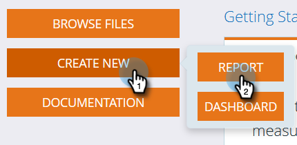
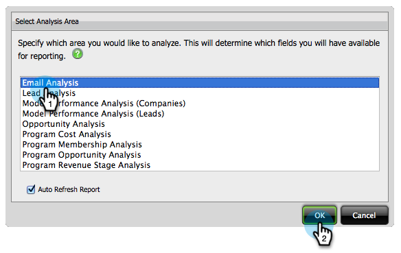
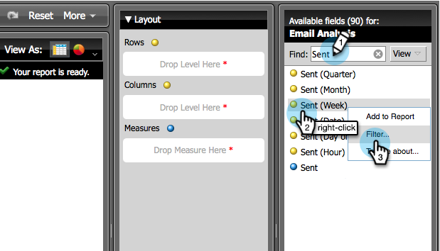
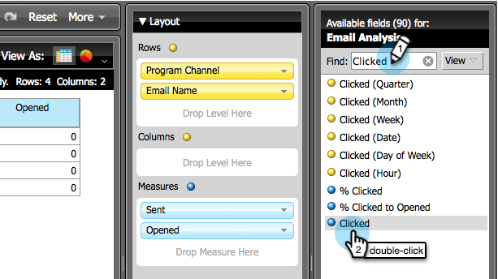
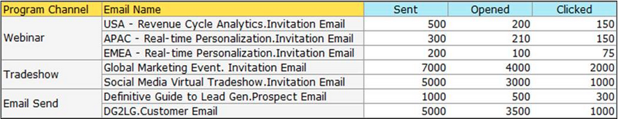

# Skapa en e-postanalysrapport som visar programinformation {#build-an-email-analysis-report-that-shows-program-information}

Följ de här stegen för att skapa en e-postanalysrapport som visar e-postinformation grupperad efter programkanaler.

>[!AVAILABILITY]
>
>Alla har inte köpt den här funktionen. Kontakta Adobe Account Team (din kontoansvarige) för mer information.

1. Starta **[!UICONTROL Revenue Explorer]**.

   

1. Klicka på **[!UICONTROL Create New]** och välj **[!UICONTROL Report]**.

   

1. Markera området **[!UICONTROL Email Analysis]** och klicka på **[!UICONTROL OK]**.

   

1. Hitta den **[!UICONTROL Sent (Week)]** gula punkten och högerklicka på den. Klicka på **[!UICONTROL Filter...]**.

   >[!NOTE]
   >
   >Detta kommer att begränsa tidsramen för rapporten.

   

1. Markera **[!UICONTROL Current Sent (Week)]** och klicka på **[!UICONTROL OK]**.

   

1. Sök och dubbelklicka på den **[!UICONTROL Program Channel]** gula punkten.

   

1. Sök och dubbelklicka på den **[!UICONTROL Email Name]** gula punkten.

   

1. Sök och dubbelklicka på de **[!UICONTROL Sent]**, **[!UICONTROL Opened]** och **[!UICONTROL Clicked]** blå punkterna.

   

   Snyggt jobb! Du borde ha en rapport som ser ut ungefär så här:

   
