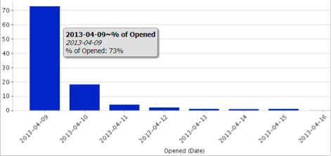

# Förstå e-postanalysområdet {#understanding-the-email-analysis-area}

E-postanalysområdet fokuserar på e-poststatistik. I den här artikeln presenteras alla rapporter som finns i artikeln.

>[!NOTE]
>
>**Tillgänglighet**
>
>Detta är tillgängligt för användare med tillägget Select Edition eller [Revenue Cycle Analytics](http://www.marketo.com/global-enterprise/marketo-revenue-cycle-analytics/) . Kontakta din säljare för mer information.

## E-postklickning på hetta rutnät för aktivitet {#email-click-activity-heat-grid}

Den här rapporten visar vilken veckodag och tid på dagen som dina leads klickar på e-post. Ju grönare lådan är desto mer klickningar på den specifika dagen och tiden. Det aktuella filtret innehåller alla e-postmeddelanden som skickats de senaste 7 dagarna. Tiden är i CST.

## E-postklickad tidsfördelning {#email-clicked-time-distribution}

Den här rapporten visar hur många procent av det totala antalet e-postklick som har gjorts varje gång på dagen. Det aktuella filtret innehåller alla e-postmeddelanden som skickats de senaste 7 dagarna. Tiden är i CST.

## Minska klickfrekvens för e-post {#email-click-rate-decay}

Den här rapporten visar hur många procent av det totala antalet e-postklick som inträffade samma dag som ett e-postmeddelande skickas och efterföljande dagar. Det aktuella filtret innehåller alla e-postmeddelanden som skickades för 7 dagar sedan.

## Värmestödraster för öppen aktivitet för e-post {#email-open-activity-heat-grid}

Den här rapporten visar vilken veckodag och tid på dagen som era leads öppnar e-postmeddelanden. Ju grönare lådan är desto mer öppnas på den specifika dagen och tiden. Det aktuella filtret innehåller alla e-postmeddelanden som skickats de senaste 7 dagarna. Tiden är i CST.

## Öppen prissänkning {#open-rate-decay}

Den här rapporten visar hur stor procentandel av det totala antalet e-postmeddelanden som öppnas samma dag som ett e-postmeddelande skickas och efterföljande dagar. Det aktuella filtret innehåller alla e-postmeddelanden som skickades för 7 dagar sedan.

## Open Time Distribution {#open-time-distribution}

Den här rapporten visar hur många procent av det totala antalet e-postmeddelanden som öppnas för varje tidpunkt på dagen. Det aktuella filtret innehåller alla e-postmeddelanden som skickats de senaste 7 dagarna. Tiden är i CST.

## Värmestödraster för skickad aktivitet {#sent-activity-heat-grid}

Den här rapporten visar vilken veckodag och tid på dagen du skickar e-postmeddelanden. Ju grönare lådan är, desto fler utskickade e-postmeddelanden på den specifika dagen och tiden. Det aktuella filtret innehåller alla e-postmeddelanden som skickats de senaste 7 dagarna. Tiden är i CST.

