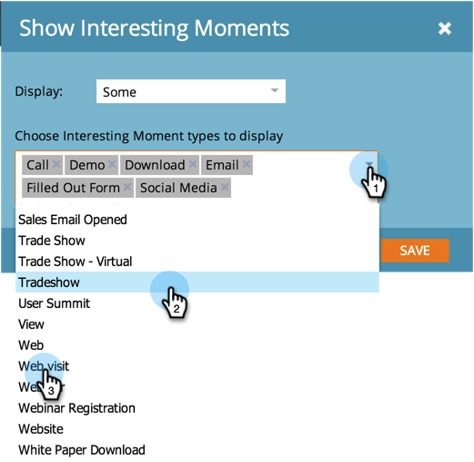

# Konfigurera en analys av säljprojektspåverkan {#configure-an-opportunity-influence-analyzer}

När du har [skapat en analys av säljprojektspåverkan](/help/marketo/product-docs/reporting/revenue-cycle-analytics/opportunity-influence-analyzer/create-an-opportunity-influence-analyzer.md) kan du konfigurera de typer av [intressanta stunder](/help/marketo/product-docs/marketo-sales-insight/msi-for-salesforce/features/tabs-in-the-msi-panel/interesting-moments/interesting-moments-overview.md) som ingår.

>[!PREREQUISITES]
>
>[Skapa en analys av affärsmöjlighet](/help/marketo/product-docs/reporting/revenue-cycle-analytics/opportunity-influence-analyzer/create-an-opportunity-influence-analyzer.md)

1. Klicka på **Analys**.

   

1. Gå till Analytics och välj din säljprojektsanalys.

   

   Om det finns för många intressanta stunder i analysdiagrammet kan du minska dem genom att avmarkera personer på panelen **Inställningar** eller genom att minska typerna av intressanta stunder.

1. Om du vill konfigurera vilka typer av intressanta stunder som ska inkluderas går du till fliken Inställningar och drar i filtret Intressanta stunder.

   

1. Välj om du vill visa alla, inga eller några.

   

1. Om du väljer Vissa kan du välja vilka typer som ska inkluderas.

   

1. Klicka på varje typ av intressanta ögonblick som du vill ha. Klicka sedan på **Spara**.

1. Klicka på huvudfliken om du vill se historiken för affärsmöjligheten med bara de valda typerna av intressanta ögonblick.

   

>[!MORELIKETHIS]
>
>[Berätta för marknadsföringsberättelsen med en analys av säljprojektspåverkan](/help/marketo/product-docs/reporting/revenue-cycle-analytics/opportunity-influence-analyzer/tell-the-marketing-story-with-an-opportunity-influence-analyzer.md)
