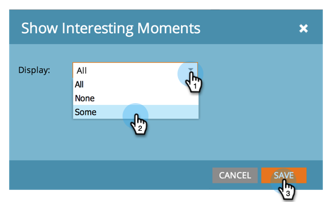

# Konfigurera en analys av affärsmöjlighet {#configure-an-opportunity-influence-analyzer}

När du har [skapat en analys av affärsmöjlighet](/help/marketo/product-docs/reporting/revenue-cycle-analytics/opportunity-influence-analyzer/create-an-opportunity-influence-analyzer.md) kan du konfigurera de typer av [intressanta stunder](/help/marketo/product-docs/marketo-sales-insight/msi-for-salesforce/features/tabs-in-the-msi-panel/interesting-moments/interesting-moments-overview.md) som ingår.

>[!PREREQUISITES]
>
>[Skapa en analys av affärsmöjlighet](/help/marketo/product-docs/reporting/revenue-cycle-analytics/opportunity-influence-analyzer/create-an-opportunity-influence-analyzer.md)

1. Klicka på **[!UICONTROL Analytics]**.

   

1. Gå till **[!UICONTROL Analytics]** och välj din analys av affärsmöjlighet.

   

   Om det finns för många intressanta stunder i analysdiagrammet kan du minska dem genom att avmarkera personer på panelen **[!UICONTROL Settings]** eller genom att minska typerna av intressanta stunder.

1. Om du vill konfigurera vilka typer av intressanta stunder som ska inkluderas går du till fliken **[!UICONTROL Setup]** och drar i filtret **[!UICONTROL Interesting Moments]**.

   

1. Välj om du vill visa **[!UICONTROL All]**, **[!UICONTROL None]** eller **[!UICONTROL Some]**.

   

1. Om du väljer **[!UICONTROL Some]** kan du sedan välja vilka typer som ska inkluderas.

   

1. Klicka på varje typ av intressant ögonblick du vill ha. Klicka sedan på **[!UICONTROL Save]**.

1. Klicka på huvudfliken om du vill se historiken för affärsmöjligheten med bara de valda typerna av intressanta ögonblick.

   

>[!MORELIKETHIS]
>
>[Berätta för marknadsföringsberättelsen med en analys av affärsmöjlighet &#x200B;](/help/marketo/product-docs/reporting/revenue-cycle-analytics/opportunity-influence-analyzer/tell-the-marketing-story-with-an-opportunity-influence-analyzer.md)
