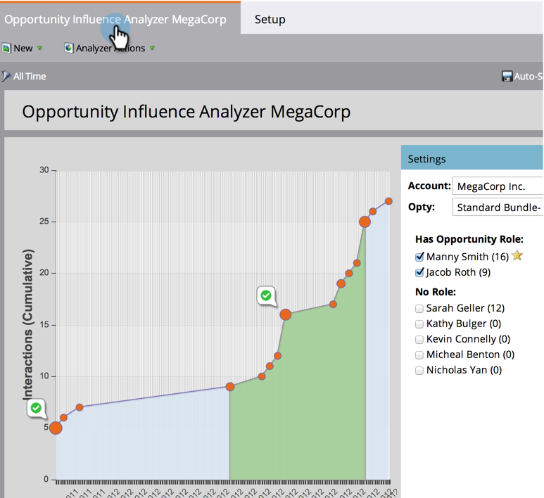

# Skapa en analys av affärsmöjlighet {#create-an-opportunity-influence-analyzer}

Använd säljprojektsanalys för att visa hur marknadsföringen bidrar till ett viktigt erbjudande. Se hur ditt program och dina event fungerar, liksom intressanta ögonblick, i hela livet.

>[!NOTE]
>
>Om du vill få bra information från en säljprojektsanalys kontrollerar du att dina kontakter är kopplade till affärsmöjligheterna i CRM.

1. Klicka **Analyser**.

   

1. Klicka **Analys av påverkan på affärsmöjlighet**.

   

1. Välj konto på **Inställningar** -panelen.

   

   >[!NOTE]
   >
   >Om du får en varning om att det inte fanns några aktiviteter under tidsramen klickar du bara **Stäng**. Vi återkommer till det efter nästa steg.

1. Välj affärsmöjligheten i det kontot.

   

1. Ange tidsperioden. Klicka på **Inställningar** och dubbelklicka **Tidsram**.

   

1. Välj tidsperioden för affärsmöjligheten som du vill analysera och klicka på **Spara**.

   

   >[!TIP]
   >
   >
   >I de flesta fall **Alla** är det enklaste valet.

1. Du är där! Klicka på huvudfliken för att se de intressanta stunderna och framgångarna i affärsmöjligheten.

   

>[!TIP]
>
>Du kan också titta på en video om hur säljprojektsanalysen fungerar i [Marketo University](https://learn.marketo.com). (Det ser lite annorlunda ut nu, men det finns fortfarande mycket att lära!)

>[!MORELIKETHIS]
>
>* [Berätta för marknadsföringsberättelsen med en analys av säljprojektspåverkan](/help/marketo/product-docs/reporting/revenue-cycle-analytics/opportunity-influence-analyzer/tell-the-marketing-story-with-an-opportunity-influence-analyzer.md)
>* [Konfigurera en analys av affärsmöjlighet](/help/marketo/product-docs/reporting/revenue-cycle-analytics/opportunity-influence-analyzer/configure-an-opportunity-influence-analyzer.md)

