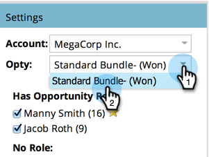

# Skapa en analys av affärsmöjlighetspåverkan {#create-an-opportunity-influence-analyzer}

Använd säljprojektsanalys för att visa hur marknadsföringen bidrar till ett viktigt erbjudande. Se hur ditt program och dina event fungerar, liksom intressanta ögonblick, i hela livet.

>[!NOTE]
>
>**Påminnelse**
>
>Om du vill få bra information från en säljprojektsanalys kontrollerar du att dina kontakter är kopplade till affärsmöjligheterna i CRM.

1. Klicka på **Analys**.

   

1. Klicka på **Affärsmöjlighetsanalys**.

   

1. Välj kontot på panelen **Inställningar**.

   

   >[!NOTE]
   >
   >Om du får ett varningsmeddelande om att det inte fanns några aktiviteter under tidsramen klickar du bara på **Stäng**. Vi återkommer till det efter nästa steg.

1. Välj affärsmöjligheten i det kontot.

   

1. Ange tidsperioden. Klicka på fliken **Inställningar** och dubbelklicka på **Tidsram**.

   

1. Välj den tidsperiod för affärsmöjligheten som du vill analysera och klicka på **Spara**.

   

   >[!TIP]
   >
   >
   >I de flesta fall är **All Time** det enklaste alternativet.

1. Du är där! Klicka på huvudfliken för att se de intressanta stunderna och framgångarna i affärsmöjligheten.

   

>[!TIP]
>
>Du kan också titta på en video om säljprojektsanalys i [Marketo University](https://learn.marketo.com). (Det ser lite annorlunda ut nu, men det finns fortfarande mycket att lära!)

>[!MORELIKETHIS]
>
>* [Berätta för marknadsföringsberättelsen med en analys av säljprojektspåverkan](tell-the-marketing-story-with-an-opportunity-influence-analyzer.md)
>* [Konfigurera en analys av affärsmöjlighet](configure-an-opportunity-influence-analyzer.md)

>

>[!NOTE]
>
>**Djupdykning**
>
>Andra analysatorer finns i [Grundläggande rapportering](http://docs.marketo.com/display/docs/basic+reporting).

