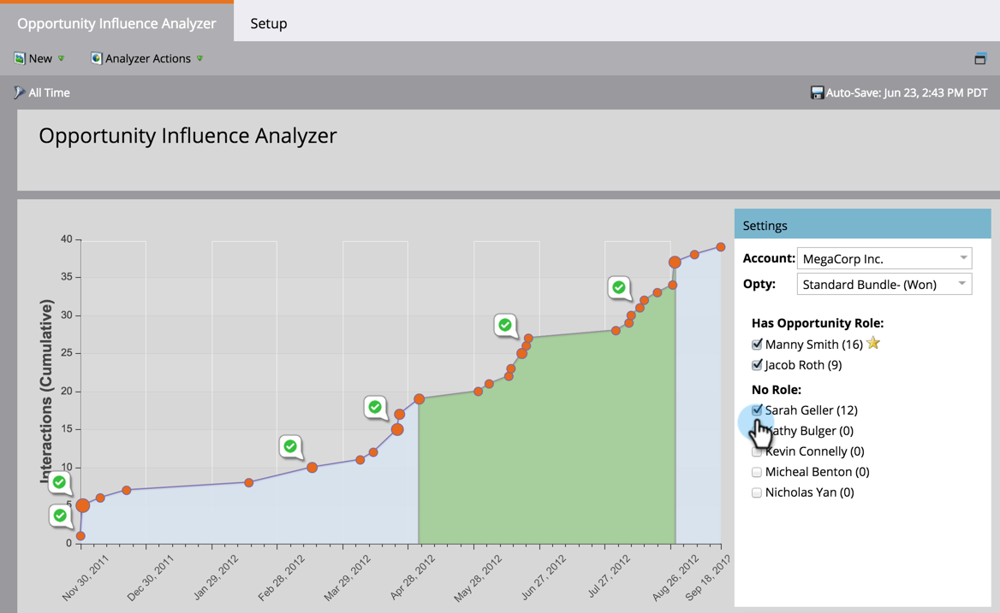

# Förstå analysen av säljprojektspåverkan {#understanding-the-opportunity-influence-analyzer}

Varje möjlighet är en historia. Var träffade du ledaren? Vilka marknadsföringsmöjligheter påverkade dem under marknadsförings-/försäljningsprocessen?

Med säljprojektsanalysen kan du se hela artikeln. Det finns till och med i Sales Insight!

**Observera de gröna kontrollerna**. De visar att programmet lyckades för ett av namnen till höger. Det gröna området anger början och slutet av affärsmöjligheten.

>[!NOTE]
>
>Analysdata uppdateras nattetid, inte i realtid.

Använd kontrollerna till höger för att lägga till/ta bort personer från diagrammet eller växla till olika konton eller affärsmöjligheter.

## Identifiera unika konton {#identifying-unique-accounts}

Marketo använder CRM-ID:t för att unikt identifiera konton.

Tidigare ansågs konton med samma namn vara ett konto. Om till exempel Washington High School var kontonamn och det fanns flera konton som hette Washington High School i USA, kombinerade vi alla till ett enda konto. Detta var felaktigt, eftersom varje skola var en självständig enhet.

Om du vill behålla det här beteendet bör du ta bort dubbletter av dina data i CRM-systemet.

>[!TIP]
>
>Varje gång du sluter ett avtal hittar du det i den här analyseraren nästa dag. Dela den med säljaren. De kommer att inse allt hårt arbete du gör - och du kan dessutom fråga varför vissa personer&quot;ser ut&quot; som inflytelserika men inte har någon roll tilldelad i CRM.

>[!MORELIKETHIS]
>
>* [Berätta för marknadsföringsberättelsen med en analys av affärsmöjlighet ](/help/marketo/product-docs/reporting/revenue-cycle-analytics/opportunity-influence-analyzer/tell-the-marketing-story-with-an-opportunity-influence-analyzer.md)
>* [Skapa en analys av affärsmöjlighet](/help/marketo/product-docs/reporting/revenue-cycle-analytics/opportunity-influence-analyzer/create-an-opportunity-influence-analyzer.md)
