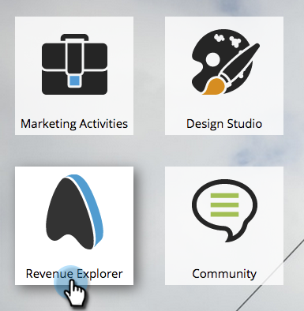

# Översikt över avancerad programrapportering {#advanced-program-reporting-overview}

**Inkomstcykeln** Explorerinnehåller flera analysområden och en mängd nya mätvärden som gör att du kan mäta programmets effektivitet.

Det finns många godbitar här inne. Vi kollar dem!

## Vad är ett analysområde? {#whats-an-analysis-area}

Analysområden innehåller olika datauppsättningar och mätvärden i Intresseutforskaren. Varje område relaterar till det rapporteringsämne som du har valt att visa.

## Programanalysområden {#program-analysis-areas}

* ** [Programkostnadsanalys](understanding-the-program-cost-analysis-area.md) **- Se avkastningen för alla program.

* ** [Analys av programmedlemskap](understanding-the-program-membership-analysis-area.md) **- Se resultat per kanal, deltagande, kriterier för lyckade försök osv.

* ** [Analys av affärsmöjligheter](understanding-the-program-opportunity-analysis-area.md) **- Affärsmöjligheter som genereras baserat på fördelning, intäkter och avkastning.

* ** [Analys av programinkomststadium](understanding-the-program-revenue-stage-analysis-area.md) **- Nya namn som har nått vissa framgångsfaser i intäktscykelmodellen.

## Programanalytiker {#program-analyzers}

* **Programanalys**  - Identifiera snabbt program som är framgångsrika eller inte och fokusera på resurserna på rätt sätt.

* **Affärsmöjlighetsanalys**  - Bevisa marknadsföringens bidrag genom att mäta effekten av program och viktiga engagemang som genererade möjligheter.

## Rapportalternativ {#report-options}

I varje rapport finns det flera alternativ som hjälper dig att anpassa upplevelsen.

>[!CAUTION]
>
>Även om du kan välja att visa rader/kolumner där måttcellen är tom (första kryssrutan) rekommenderar vi att du inte gör det eftersom det kan göra bearbetningen långsammare och till och med göra en timeout i rapporten.

>[!NOTE]
>
>Data i Revenue Cycle Explorer uppdateras direkt från er Marketo. Därför kommer alla ändringar av din person- och kontoaktivitet i Marketo att återspeglas nästa arbetsdag i Invenue Cycle Explorer.

Genom att bekanta dig med intäktsanalys får ni full insikt i era program och deras effekt.