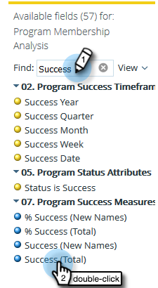

# Skapa en analysrapport för programmedlemskap som listar leads {#build-a-program-membership-analysis-report-that-lists-leads}

Följ de här stegen för att skapa en analysrapport för programmedlemskap som visar alla namn på programmedlemmar.

>[!AVAILABILITY]
>
>
>Alla kunder har inte köpt den här funktionen. Kontakta din säljare för mer information.

1. Starta Intresseutforskaren.

   

1. Klicka på Skapa ny och sedan Rapport.

   

1. Välj Analys av programmedlemskap och klicka på OK.

   

1. Sök och dubbelklicka på den gula punkten Programnamn.

   

1. Sök efter och dubbelklicka på den blå pricken Medlemmar.

   

1. Sök efter och dubbelklicka på den blå punkten Slutfört (totalt).

   

Se hur enkelt det var?

Du kan snabbt lägga till ett lead-attribut som **Fullständigt namn** för att se vilka medlemmarna är.

>[!TIP]
>
>Det finns många lead-/företagsattribut att välja bland. Kolla in dem!

1. Sök efter och dubbelklicka på den gula punkten med fullständigt namn.

   

Där har du den!

