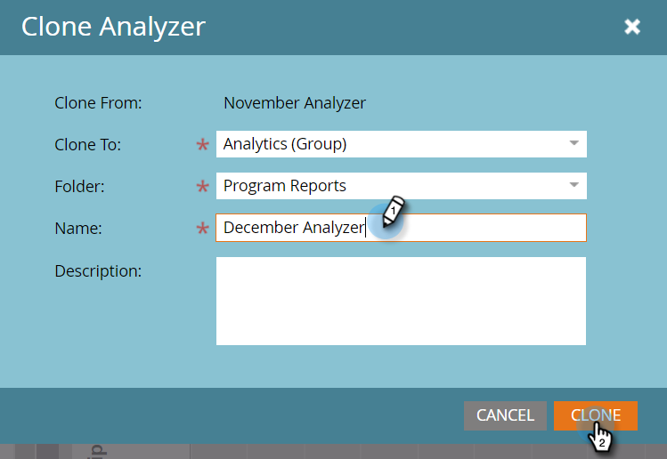

# Klona en programanalys {#clone-a-program-analyzer}

När du har sparat en analyserare är det enkelt att klona den och skapa en ny. Gå sedan in och redigera den nya om det behövs några ändringar.

1. Klicka på rutan **Analytics **.

   

1. Klicka på **programanalysrutan**.

   

1. Öppna listrutan Analyzer-åtgärder när den sparade analysen är öppen och välj **Klonanalys**.

   

1. Välj plats för den klonade analyseraren i listrutorna **Klona till** och **Mapp**.

   

1. Namnge den klonade analyseraren och klicka på **Klona**.

   

1. Nu har du två identiska analysatorer med olika namn. Öppna klonen för att göra nödvändiga ändringar.

   

   >[!MORELIKETHIS]
   >
   >
   >    
   >    
   >    * [Skapa en programanalys](create-a-program-analyzer.md)

