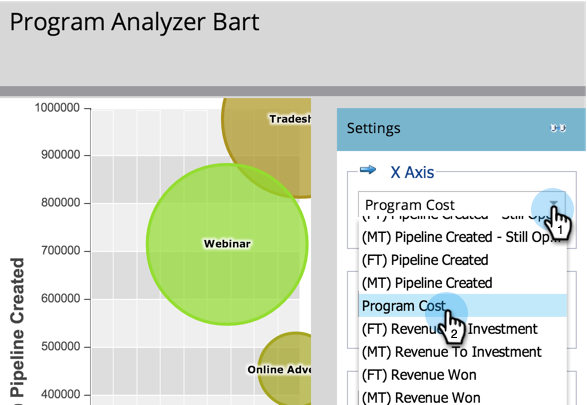
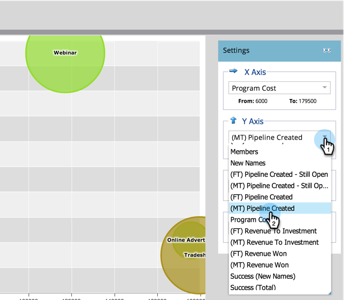
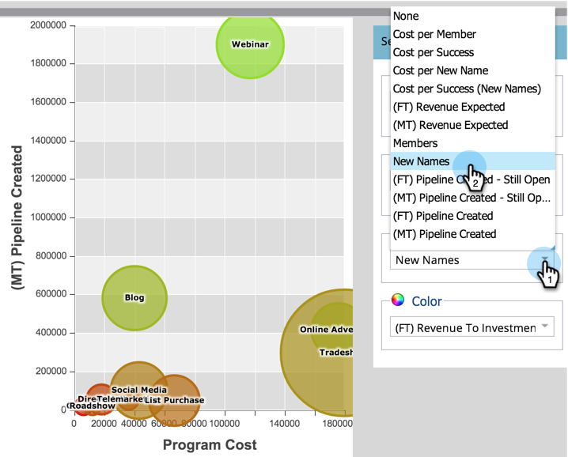

# Jämför kanaleffektiviteten med programanalysen {#compare-channel-effectiveness-with-the-program-analyzer}

Använd Program Analyzer för att jämföra kanalkostnader, medlemsförvärv, pipeline, intäkter med mera för att identifiera era mest effektiva kanaler.

>[!PREREQUISITES]
>
>* [Skapa en programanalys](create-a-program-analyzer.md)

1. Klicka på **Analytics** i **My Marketo.**

   

1. Välj din **programanalys.**

   

1. Ändra vyn till **By** **Kanal**.

   

1. Använd listrutan **X-axel** för att välja ett mått för den vågräta axeln. Vi börjar med **Programkostnad**.

   

1. Använd listrutan Y-axel för att välja ett mått för den lodräta axeln. Här följer en **(FT)-pipeline skapad**.

   

   >[!NOTE]
   >
   >Många av de mätvärden du kan välja i programanalysen är tillgängliga med beräkningar med första beröringen (FT) och multitouch (MT). Det är viktigt att förstå skillnaden [mellan FT- och MT-attribuering](/help/marketo/product-docs/reporting/revenue-cycle-analytics/revenue-tools/attribution/understanding-attribution.md).

1. Använd listrutan **Y-axel** för att välja **(MT) Pipeline skapad**.

   

   I den här flerberöringsattribueringsvyn ser vi att webbseminariekanalen har större påverkan på den pipeline som skapas och mindre kostnader än kanalerna Tradeshow och Online Advertising.

   Nu ska vi lägga till ytterligare två dimensioner!

1. Använd listrutan **Bubbelstorlek** för att välja ytterligare ett mått, som **Nya namn**.

   

1. Se hur diagrammet ändras.

   

   Vi ser att webbseminariekanalen krymper, enligt **Nya namn**. Vi kan dra slutsatsen att även om den har många medlemmar är det mindre effektivt att generera nya leads än Tradeshow-kanalen.

1. Använd slutligen listrutan Färg för att lägga till den fjärde dimensionen. Vi väljer **(FT) Revenue** **Won**.

   

1. Se hur färgerna ändras i diagrammet.

   

   Av färgerna har vi fått veta att Tradeshow-kanalen, den grönaste bubblan, har påverkat de största intäkterna, som mäts med första-beröringsattribuering.

1. Om vi nu ändrar Color-måttet till **(MT) Revenue Won** ser vi att Online Advertising Channel, nu den grönaste, påverkade mer intäkter -over time_ än webbseminariet och Tradeshow-kanalerna.

   

I vårt exempel ser vi att Tradeshow-kanalen både är den mest dyra (längst till höger) och den mest framgångsrika (högst på Y-axeln) när man mäter pipeline som skapats med första beröring. Låt oss nu titta på varje kanals pipeline som skapats som en funktion av multitouch-attribuering.

>[!TIP]
>
>Exemplen i dessa steg mäter effektiviteten utifrån den pipeline som skapats. Använd listrutan Y-axel för att välja andra sätt att mäta kanalens effektivitet, t.ex. nya namn, medlemmar, kostnad per lyckad åtgärd osv.

>[!NOTE]
>
>**Relaterade artiklar**
>
>* [Utforska program- och kanalinformation med Program Analyzer](explore-program-and-channel-details-with-the-program-analyzer.md)
>* [Jämför programeffektiviteten med programanalysen](compare-program-effectiveness-with-the-program-analyzer.md)

>

>[!NOTE]
>
>Läs mer om avancerad analys i [Inkomstcykelutforskaren](http://docs.marketo.com/display/docs/revenue+cycle+analytics).
