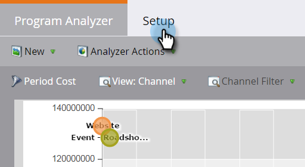

# Skapa en programanalys {#create-a-program-analyzer}

Upptäck vilka program och kanaler som ger er den största rabatten för er marknadsföring. Använd programanalysverktyget för att granska och jämföra alla kostnader och intäkter i detalj, per program eller kanal.

>[!NOTE]
>
>Om du vill få bra data från en programanalys kontrollerar du att dina CRM-kontakter har roller i affärsmöjligheterna och att dina Marketo-program är helt konfigurerade, med [periodkostnader](/help/marketo/product-docs/reporting/revenue-cycle-analytics/revenue-tools/define-period-costs.md), programstatus och slutförda åtgärder definierade.

>[!TIP]
>
>Om du vill att program utan kostnad ska visas i programanalysen anger [periodkostnaden](/help/marketo/product-docs/reporting/revenue-cycle-analytics/revenue-tools/define-period-costs.md) till $0.

1. Klicka på rutan **Analyser**.

   

1. Klicka på rutan **Programanalys**.

   

1. Standardprogramanalysen visas. Gör de ändringar du behöver.

   

1. Klicka på fliken **Konfigurera** för att lägga till och anpassa filter.

   

1. Om du till exempel vill anpassa periodkostnadsfiltret dubbelklickar du på det.

   

1. Välj den tidsperiod som du vill analysera och klicka på **Använd**.

   

   >[!TIP]
   >
   >Om du vill markera ett visst intervall väljer du **Egen** och använder fälten **Från** och **Till**.

1. Om du vill spara din nya anpassade analysator väljer du **Spara som** i listrutan Analyzer-åtgärder.

   

1. Välj den plats där du vill spara den anpassade analysen med listrutorna Spara till och Mapp. Ge den nya anpassade analyseraren ett namn. En beskrivning är valfri. Klicka på **Spara**.

   

1. Du har gjort det! Klicka på huvudfliken för att börja utforska och jämföra program och kanaler.

>[!NOTE]
>
>Många av de mätvärden du kan välja i programanalysen är tillgängliga med beräkningar med första beröringen (FT) och multitouch (MT). Det är viktigt att förstå skillnaden [mellan FT- och MT-attribuering](/help/marketo/product-docs/reporting/revenue-cycle-analytics/revenue-tools/attribution/understanding-attribution.md).

>[!MORELIKETHIS]
>
>* [Jämför kanaleffektivitet med programanalysen](/help/marketo/product-docs/reporting/revenue-cycle-analytics/program-analytics/compare-channel-effectiveness-with-the-program-analyzer.md)
>* [Jämför programeffektivitet med programanalysen](/help/marketo/product-docs/reporting/revenue-cycle-analytics/program-analytics/compare-program-effectiveness-with-the-program-analyzer.md)
>* [Utforska program- och kanalinformation med Program Analyzer](/help/marketo/product-docs/reporting/revenue-cycle-analytics/program-analytics/explore-program-and-channel-details-with-the-program-analyzer.md)
>* [Klona en programanalys](/help/marketo/product-docs/reporting/revenue-cycle-analytics/program-analytics/clone-a-program-analyzer.md)
