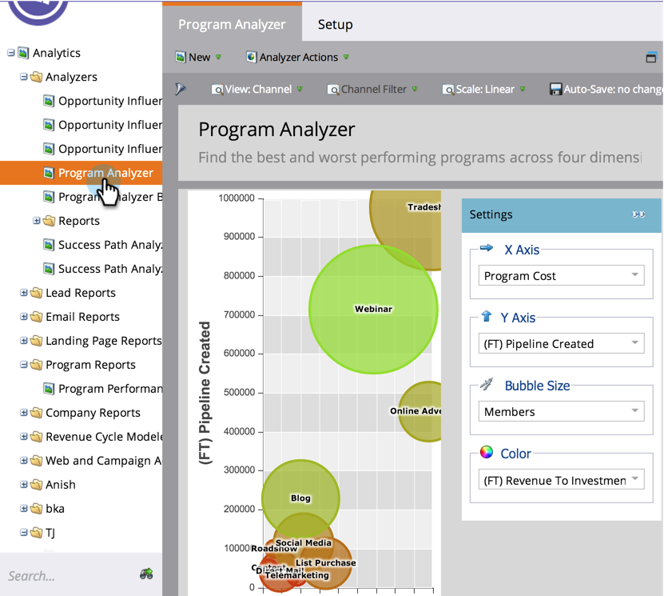
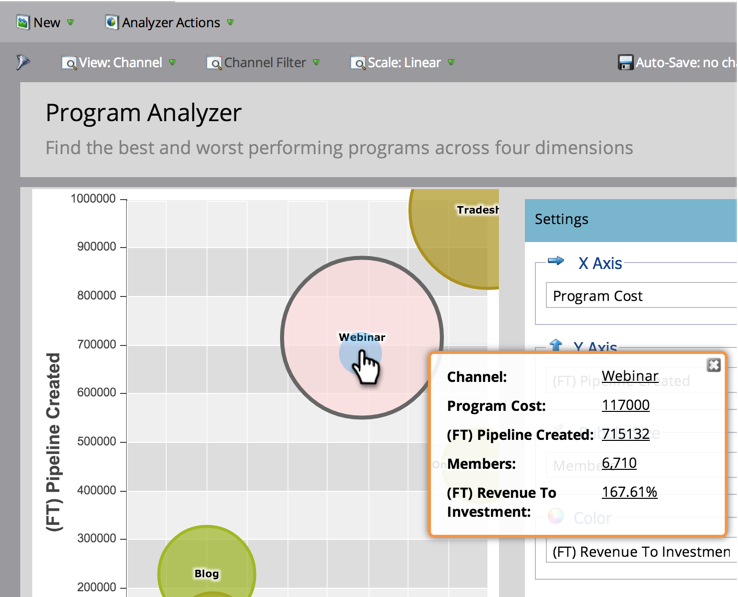

# Utforska program- och kanalinformation med Program Analyzer {#explore-program-channel-details-with-the-program-analyzer}

Du kan se detaljerad program- och kanalstatistik i Program Analyzer. Du kan även öppna dem i intäktscykelutforskaren.

>[!NOTE]
>
>**Förutsättningar**
>
>* [Skapa en programanalys](create-a-program-analyzer.md)

>[!NOTE]
>
>**Tillgänglighet**
>
>Alla utgåvor av Marketo innehåller inte den här funktionen. Kontakta din kontoansvarige om du vill ha mer information.

1. Klicka på **Analytics**.

   

1. Välj programanalyseraren.

   

1. Klicka på motsvarande bubbla om du vill visa den specifika statistiken för en kanal eller ett program (beroende på vilken **vy** du väljer).

   

   >[!NOTE]
   >
   >Många av de mätvärden du kan välja i programanalysen är tillgängliga med beräkningar med första beröringen (FT) och multitouch (MT). Det är viktigt att förstå [skillnaden mellan FT- och MT-attribuering](/help/marketo/product-docs/reporting/revenue-cycle-analytics/revenue-tools/attribution/understanding-attribution.md).

1. Om du vill jämföra alla program i en enda kanal klickar du på kanalnamnet i popup-dialogrutan.

   

1. Nu kan du jämföra de enskilda programmen i den kanalen!

   

   >[!NOTE]
   >
   >När du klickar på en kanal ändras vyn till Efter program, filtrerat till just den kanalen. Om du vill återgå till alla kanaler väljer du **Visa** > **Efter kanal**.

1. Om du vill öppna Inkomstcykelutforskaren och fördjupa dig i en statistik klickar du på siffran i popup-dialogrutan.

   

   >[!NOTE]
   >
   >Läs mer om avancerad analys i [Revenue Explorer](http://docs.marketo.com/display/docs/revenue+explorer).
