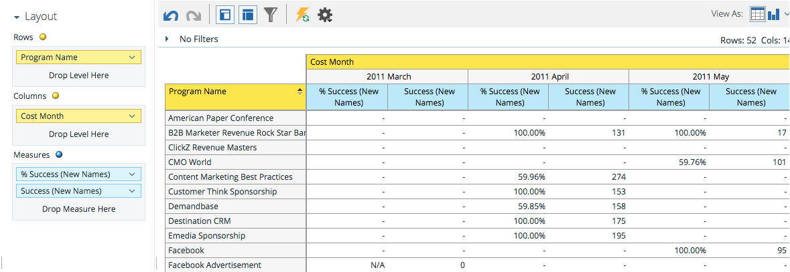

# Förstå området för programkostnadsanalys {#understanding-the-program-cost-analysis-area}

Under Programkostnadsanalys kan du analysera effektiviteten i enskilda program eller se summerade resultat per kanal under en viss tidsperiod.

## Exempel på affärsfrågor {#example-business-questions}

Hur många nya namn genererade varje kanal per månad?

Vad kostade jag per nytt namn per kanal och månad?

Hur stor procentandel av de nya namnen som genereras lyckades i ett program?

Hur mycket spenderade jag per program och månad?

## Dimensioner och åtgärder för programkostnadsanalys {#program-cost-analysis-dimensions-and-measures}

>[!NOTE]
>
>Gula punkter är dimensioner och blå punkter är mått.

## Investeringar {#investment}

| Mät | Beskrivning |
|---|---|
| Kostnad per medlem | Genomsnittlig kostnad per programmedlem |
| Kostnad per nytt namn | Genomsnittlig kostnad per lead som förvärvats av programmet |
| Kostnad per lyckad åtgärd | Genomsnittlig kostnad per lead som uppnått framgång i ett programs utveckling |
| Kostnad per lyckad åtgärd (nya namn) | Genomsnittlig kostnad per lead som förvärvats av programmet OCH som uppnått framgång i programmets utveckling |
| Programkostnad | Total periodkostnad för programmet |

## medlemskap {#membership}

<table> 
 <tbody> 
  <tr> 
   <th>Mät</th> 
   <th>Beskrivning</th> 
  </tr> 
  <tr> 
   <td>
% nya namn
</td> 
   <td>Andel leads som förvärvats av ett program</td> 
  </tr> 
  <tr> 
   <td>Medlemmar</td> 
   <td>Totalt antal leads i ett program</td> 
  </tr> 
  <tr> 
   <td>Nya namn</td> 
   <td>Totalt antal nya namn som hämtats av ett program</td> 
  </tr> 
 </tbody> 
</table>

## Programattribut {#program-attributes}

| Dimension | Beskrivning |
|---|---|
| Programkanal | Programkanal |
| Programnamn | Programnamn |

## Tidsram för programkostnad {#program-cost-timeframe}

| Dimension | Beskrivning |
|---|---|
| År | Tidsram för programkostnad |
| Kvartal | Tidsram för programkostnad |
| Månad | Tidsram för programkostnad |

## Programtaggar {#program-tags}

| Mät | Beskrivning |
|---|---|
| Bransch | Programtagg |
| Produktserie | Programtagg |
| Programägare | Programtagg |
| Län | Programtagg |

## Lyckades {#success}

| Mät | Beskrivning |
|---|---|
| % lyckades (nya namn) | Procent av leads som förvärvades av programmet OCH som uppnådde framgång i programmets förlopp |
| % lyckades (totalt) | Andel leads som lyckades i ett programs utveckling |
| Lyckades (nya namn) | Totalt antal nya namn som lyckades under ett programs förlopp |
| Slutfört (totalt) | Totalt antal leads som lyckades under ett programs förlopp |

