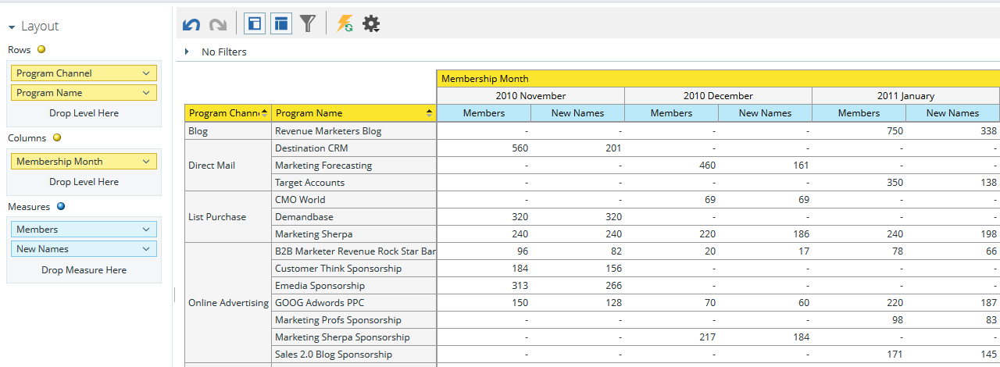

# Förstå analysområdet för programmedlemskap {#understanding-the-program-membership-analysis-area}

Under Analys av programmedlemskap kan du analysera enskilda programs effektivitet eller se summerade resultat per kanal under en viss tidsperiod.

## Exempel på affärsfrågor {#example-business-questions}

Hur många deltog i ett program per kanal under en viss månad?

Hur många lyckades uppnå ett visst program?

Hur många nya namn genererade varje program/kanal per månad?

## Analysdimensioner och åtgärder för programmedlemskap {#program-membership-analysis-dimensions-and-measures}

>[!NOTE]
>
>Gula punkter är dimensioner och blå punkter är mått.

### medlemskap {#membership}

| Mät | Beskrivning |
|---|---|
| % nya namn | Procent av leads som förvärvats i ett program |
| Medlemmar | Totalt antal leads i ett program |
| Nya namn | Totalt antal nya namn som hämtats av ett program |

### Programattribut {#program-attributes}

| Dimension | Beskrivning |
|---|---|
| Programkanal | Programkanal |
| Programnamn | Programnamn |

### Tidsram för programmedlemskap {#program-membership-timeframe}

| Dimension | Beskrivning |
|---|---|
| År | Tidsram för programmedlemskap |
| Kvartal | Tidsram för programmedlemskap |
| Månad | Tidsram för programmedlemskap |
| Vecka | Tidsram för programmedlemskap |
| Datum | Tidsram för programmedlemskap |

### Lyckades {#success}

| Mät | Beskrivning |
|---|---|
| % lyckades (nya namn) | Procent av leads som förvärvades av programmet OCH som uppnådde framgång i programmets förlopp |
| % lyckades (totalt) | Andel leads som lyckades i ett programs utveckling |
| Lyckades (nya namn) | Totalt antal nya namn som lyckades under ett programs förlopp |
| Slutfört (totalt) | Totalt antal leads som lyckades under ett programs förlopp |
