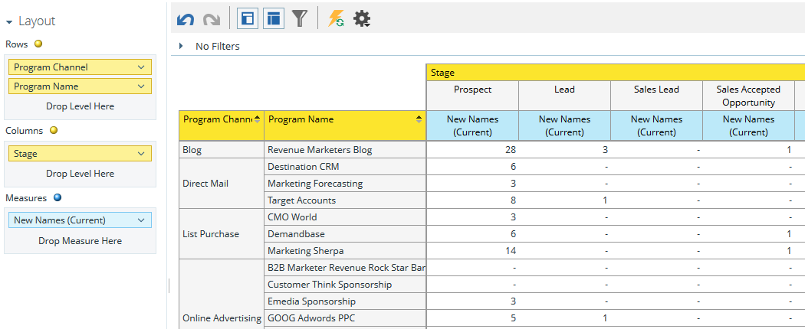

# Understanding the Program Revenue Stage Analysis Area {#understanding-the-program-revenue-stage-analysis-area}

I det här analysområdet kan du analysera effektiviteten i enskilda program eller se summerade resultat per kanal. Här får du insikt i hur många av de nya namnen som har genererats har nått vissa framgångar inom modellen för intäktscykler.

**Exempel på affärsfrågor som du kan svara på i det här analysområdet är:**

Hur många nya namn från ett visst program har någonsin nått en viss fas i min modell?

Hur många nya namn från ett visst program befinner sig för närvarande i en viss fas i min modell?

Hur många dagar tar det att få leads till sin nuvarande fas?

**Dimensioner och åtgärder för analys av programintäkter**

Dimensioner och mått är indelade i funktionalitet och representeras av gula eller blå punkter i systemet: gult för mått och blått för mått. Använd mått och mått för analys av programintäkter för att besvara specifika frågor i rapporten.

Om du vill visa tillgängliga dimensioner eller mått inom en kategori klickar du på högerpilen bredvid ett kategorinamn för att utöka kategorilistan. Klicka på nedpilen för att komprimera kategorilistan.

>[!TIP]
>
>Om du vill ha mer information om en viss dimension eller ett visst mått i rapporten för du muspekaren över den.

**Modellattribut**

<table> 
 <tbody> 
  <tr> 
   <td colspan="1" rowspan="1"><strong>Dimension</strong></td> 
   <td colspan="1" rowspan="1">
<strong>Beskrivning</strong>
</td> 
  </tr> 
  <tr> 
   <td colspan="1" rowspan="1">
Är modellen aktiv
</td> 
   <td colspan="1" rowspan="1">
Beskriver om modellen är godkänd och aktiv
</td> 
  </tr> 
  <tr> 
   <td colspan="1" rowspan="1">
Är scenen aktiv
</td> 
   <td colspan="1" rowspan="1">
Beskriver om scenen är aktiv
</td> 
  </tr> 
  <tr> 
   <td colspan="1" rowspan="1">
Vid lyckad sökväg
</td> 
   <td colspan="1" rowspan="1">
Beskriver om scenen är på framgångsvägen eller inte
</td> 
  </tr> 
  <tr> 
   <td colspan="1" rowspan="1">
Modell
</td> 
   <td colspan="1" rowspan="1">
Modellnamn
</td> 
  </tr> 
  <tr> 
   <td colspan="1" rowspan="1">
Scen
</td> 
   <td colspan="1" rowspan="1">
De faser som finns i intäktscykelmodellen. Används som Från-fasen vid analys av mått mellan två faser
</td> 
  </tr> 
  <tr> 
   <td colspan="1" rowspan="1">
Scentyp
</td> 
   <td colspan="1" rowspan="1">
Beskriver vilken typ. Inventering, SLA eller Gate varje fas är
</td> 
  </tr> 
 </tbody> 
</table>

**Programattribut**

<table> 
 <tbody> 
  <tr> 
   <td colspan="1" rowspan="1">
<strong>Dimension</strong>
</td> 
   <td colspan="1" rowspan="1">
<strong>Beskrivning</strong>
</td> 
  </tr> 
  <tr> 
   <td colspan="1" rowspan="1">
Programkanal
</td> 
   <td colspan="1" rowspan="1">
Programkanal
</td> 
  </tr> 
  <tr> 
   <td colspan="1" rowspan="1">
Programnamn
</td> 
   <td colspan="1" rowspan="1">
Programnamn
</td> 
  </tr> 
 </tbody> 
</table>

**Tidsram för programkostnad**

<table> 
 <tbody> 
  <tr> 
   <td colspan="1" rowspan="1">
<strong>Dimension</strong>
</td> 
   <td colspan="1" rowspan="1">
<strong>Beskrivning</strong>
</td> 
  </tr> 
  <tr> 
   <td colspan="1" rowspan="1">
Kostnadsår
</td> 
   <td colspan="1" rowspan="1">
Tidsram för programkostnad
</td> 
  </tr> 
  <tr> 
   <td colspan="1" rowspan="1">
Kostnadskvartal
</td> 
   <td colspan="1" rowspan="1">
Tidsram för programkostnad
</td> 
  </tr> 
  <tr> 
   <td colspan="1" rowspan="1">
Kostnadsmånad
</td> 
   <td colspan="1" rowspan="1">
Tidsram för programkostnad
</td> 
  </tr> 
 </tbody> 
</table>

**Scenmedlemskap**

<table> 
 <tbody> 
  <tr> 
   <td colspan="1" rowspan="1">
<strong>Mät</strong>
</td> 
   <td colspan="1" rowspan="1">
<strong>Beskrivning</strong>
</td> 
  </tr> 
  <tr> 
   <td colspan="1" rowspan="1">
Är modellen aktiv
</td> 
   <td colspan="1" rowspan="1">
Beskriver om modellen är godkänd och aktiv
</td> 
  </tr> 
  <tr> 
   <td colspan="1" rowspan="1">
Är scenen aktiv
</td> 
   <td colspan="1" rowspan="1">
Beskriver om scenen är aktiv
</td> 
  </tr> 
  <tr> 
   <td colspan="1" rowspan="1">
Vid lyckad sökväg
</td> 
   <td colspan="1" rowspan="1">
Beskriver om scenen är på framgångsvägen eller inte
</td> 
  </tr> 
  <tr> 
   <td colspan="1" rowspan="1">
Kostnad per nytt namn
</td> 
   <td colspan="1" rowspan="1">
Genomsnittskostnaden för ett nytt namn som någonsin nått stadiet
</td> 
  </tr> 
  <tr> 
   <td colspan="1" rowspan="1">
Nya namn (aktuella)
</td> 
   <td colspan="1" rowspan="1">
Totalt antal leads som för närvarande befinner sig på stadiet och förvärvats av programmet
</td> 
  </tr> 
  <tr> 
   <td colspan="1" rowspan="1">
Nya namn (någonsin)
</td> 
   <td colspan="1" rowspan="1">
Beskriver vilken typ. Inventering, SLA eller Gate varje fas är
</td> 
  </tr> 
 </tbody> 
</table>

>[!NOTE]
>
>**Relaterade artiklar**
>
>[Skapa en rapport för intäktsutforskaren](../../../../product-docs/reporting/revenue-cycle-analytics/revenue-explorer/create-a-revenue-explorer-report.md)
