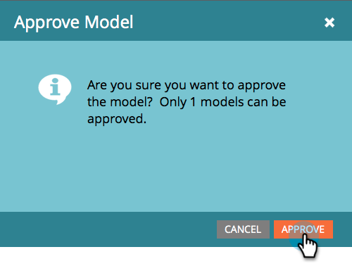

# Godkänn/avgodkänn en intäktsmodell {#approve-unapprove-a-revenue-model}

Du får bara ha en godkänd modell åt gången.

>[!CAUTION]
>
>[Enskilda etapper måste godkännas](/help/marketo/product-docs/reporting/revenue-cycle-analytics/revenue-cycle-models/approving-stages-and-assigning-leads-to-a-revenue-model.md) och personer som lagts till innan du godkänner en hel modell.

## Godkänn {#approve}

1. Gå till **Analyser** område.

   

1. Välj en modell i trädet.

   

1. Från **Modellåtgärder** meny, välja **Godkänn modell**.

   

1. En dialogruta visas där du kan bekräfta ditt val. Klicka **Godkänn**.

   

Din modell är nu levande!

## Ogodkänd {#unapprove}

>[!CAUTION]
>
>Om du inte godkänner din modell tas alla dina personer bort från modellen och deras historik i modellen tas bort!

1. Gå till **Analyser** område.

   

1. Välj en modell i trädet.

   

1. Klicka på **Modellåtgärder** meny och välj **Ogodkänd modell**.

   

1. Klicka på **Ogodkänd modell**.

   

Grattis! Din modell har inte godkänts.

>[!CAUTION]
>
>Om du avgodkänner en modell tas alla dina personer bort från modellen och deras historik i modellen tas bort från databasen.
