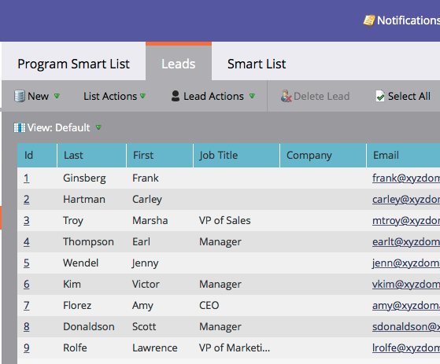

# Godkänna faser och tilldela leads till en intäktsmodell {#approving-stages-and-assigning-leads-to-a-revenue-model}

Kom igång med **intäktsmodellen** **** genom att lägga till befintliga leads och skapa tilldelningsregler för nya leads.

## Godkännandesteg {#approving-stages}

Låt oss godkänna modellens faser innan du lägger till några leads.

1. Gå till **Analytics- **området.** **

   

1. Markera modellen vars stadier du vill godkänna.

   

1. Under **Modellåtgärder** väljer du **Godkänn** **steg**.

   

1. Du får en varning; Klicka på **Tilldela leads**.

   

Underbar! Låt oss gå vidare och tilldela leads.

## Tilldela befintliga leads {#assigning-existing-leads}

[Skapa en smart lista](../../../../product-docs/core-marketo-concepts/smart-lists-and-static-lists/creating-a-smart-list/create-a-smart-list.md) för att identifiera leads för ett steg i modellen i din lead-databas.

1. När du har [skapat den smarta listan](../../../../product-docs/core-marketo-concepts/smart-lists-and-static-lists/creating-a-smart-list/create-a-smart-list.md)klickar du på fliken **Leads** .

   

1. Klicka på **Markera alla** för att markera leads.

   

1. Öppna listrutan **Leadåtgärder** och välj **Special**. Klicka på **Ändra intäktsfas**.

   

1. Välj rätt **modell** och rätt **scen**. Klicka på **Kör nu**.

   

1. Upprepa tills alla dina leads har tilldelats de olika stegen i modellen.

Bra! Om du vill ange hur nya leads tilldelas till faser skapar du tilldelningsregler.

>[!NOTE]
>
>Om din modell är i läget Godkända stadier visas inga Change Revenue Stage-händelser i leads aktivitetsloggar. Om modellen är helt godkänd hoppas det här flödessteget över om du flyttar ett lead till samma fas som det befinner sig i.

## Nya leads: Skapa tilldelningsregler  {#new-leads-create-assignment-rules}

1. Klicka** Marketo Home** igen och välj sedan **Analytics**.

   

1. `Click your model in the tree, then the`**`Model Actions`**`menu, selecting`**`Assignment Rules`** `.`

   

1. `If your assignment rules contain more than just one default choice click **Stage, **make your selection, then click`**`Add Choice`**`.`

   

## Exempel på tilldelningsregel {#example-assignment-rule}

Skapa en huvudpoängsregel om du vill tilldela nya leads med ett minimipoängtal till ett lämpligt steg.

1. Under **If** väljer du **Leadpoäng**. Välj sedan **åtminstone**.
` 

   `

1. Ange **40** i fältet och välj **Försäljningslead** som en fas. Klicka på **Spara** för att slutföra.

   

>[!NOTE]
>
>**Relaterade artiklar**
>
>Om du vill godkänna din modell kan du läsa hjälpsidan om ** [Godkänna och Avgodkänna en intäktsmodell](approve-unapprove-a-revenue-model.md)**.

