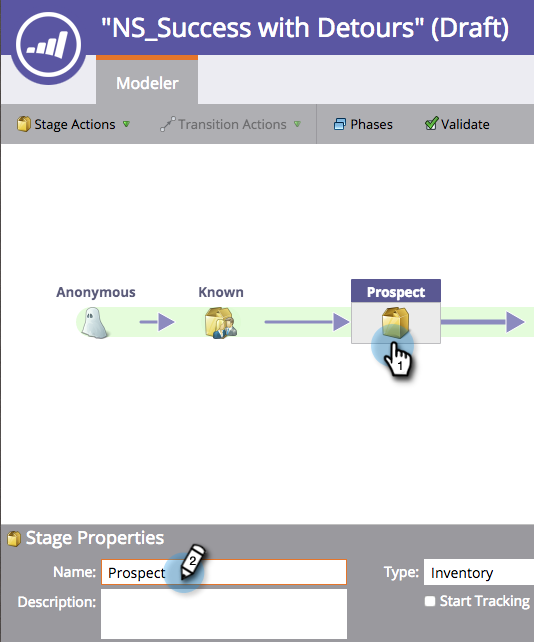

# Ändra namnet på en scen {#changing-the-name-of-a-stage}

Vill du ändra dig? Inte ett problem. Det är enkelt att byta namn på en fas i intäktscykelmodellen.

1. Gå till området **Analytics**.

   

1. Välj en modell för intäktscykel som ska uppdateras. Klicka på **Redigera utkast**.

   

1. Markera den scen som du vill uppdatera och ange ett nytt **namn**.

   

   Klicka på Stäng.
   

   Ser du? Enkelt! Kom ihåg att [godkänna din modell](approve-unapprove-a-revenue-model.md).

