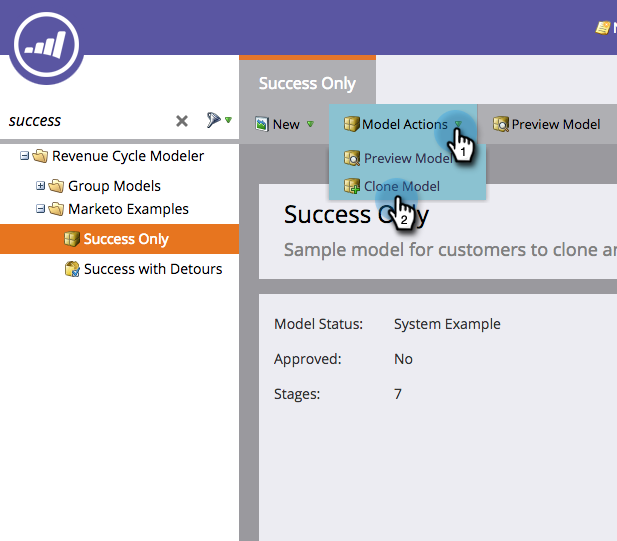

# Klona en Marketo-exempelintäktsmodell {#cloning-a-marketo-example-revenue-model}

Marketo har exempel på intäktsmodellerare som kan inspirera dig. Klona modellerna och gör dem till dina egna. Så här:

1. Gå till **Analytics** .

   

1. Välj mappen **Revenue Cycle Modeler **och klicka på **Marketo Examples**.

   

1. Välj en av modellerna.

   

   Välj Klonmodell i Modellåtgärder.
   

1. Ange ett **Name **och klicka på **CLONE**.

   

   Om det bara var så här enkelt att generera intäkter!

