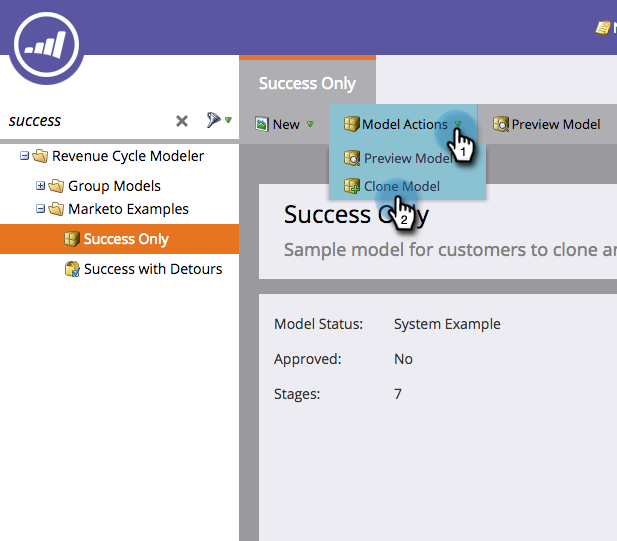

# Klona en Marketo exempelintäktsmodell {#cloning-a-marketo-example-revenue-model}

Marketo har exempel på intäktsmodeller som kan inspirera dig. Klona modellerna och gör dem till dina egna. Så här:

1. Gå till området **[!UICONTROL Analytics]**.

   

1. Välj mappen **[!UICONTROL Revenue Cycle Modeler]** och klicka på **[!UICONTROL Marketo Examples]**.

   

1. Välj en av modellerna.

   

1. Välj [!UICONTROL Model Actions] från **[!UICONTROL Clone Model]**.

   

1. Ange en **[!UICONTROL Name]** och klicka på **[!UICONTROL Clone]**.

   

   Om det bara var så här enkelt att generera intäkter!
