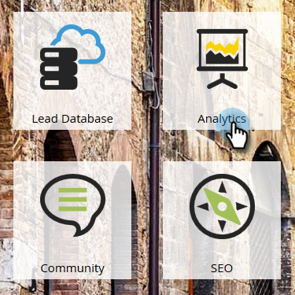

# Skapa en sökvägsanalys {#create-a-success-path-analyzer}

Få en visuell representation av hastighet och flöde genom din [intäktscykelmodell](http://docs.marketo.com/display/docs/revenue+cycle+analytics).

>[!PREREQUISITES]
>
>[Skapa en ny intäktsmodell](create-a-new-revenue-model.md)

1. Klicka på Analytics-panelen.

   

1. Klicka på ikonen Success Path Analyzer.

   

   >[!NOTE]
   >
   >Om du får en varning om att inga data hittades i den angivna tidsramen klickar du bara på **Stäng** för att ändra tidsramen. Om du inte uppmanas att göra det men vill ändra tidsramen går du till **Inställningar** och dubbelklickar** ****Tidsram**.

1. Om du inte har några data eller om du ändrar tidsramen väljer du en i listrutan och klickar på Spara.

   

   >[!TIP]
   >
   >Om du vill markera ett visst intervall väljer du **Egen** och använder fälten **Från** och **Till**.

1. Om du har fler än en intäktscykelmodell väljer du den du vill ha på fliken Inställningar.

   

1. Välj lämplig modell och klicka på Använd.

   

1. Klicka på fliken Success Path Analyzer.

   

Nu kan du utforska hur du rör dig mellan scenerna!

>[!TIP]
>
>Vill du spara din rapport? Klicka på listrutan **Analysåtgärder** och välj **Spara som**.

>[!NOTE]
>
>**Relaterade artiklar**
>
>* [Använda sökvägsanalysen](using-the-success-path-analyzer.md)

>

