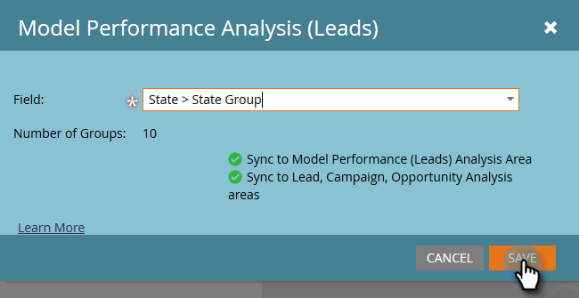

# Aktivera anpassade fältgrupper för modellresultatanalys (leads) {#enable-custom-field-groups-for-model-performance-analysis-leads}

>[!PREREQUISITES]
>
>Kategorisera standardfält eller anpassade fält i grupper för att rapportera via fältorganiseraren i Marketo. Mer information finns i [Skapa anpassade fältgrupper via fältorganiseraren](/help/marketo/product-docs/reporting/revenue-cycle-analytics/revenue-tools/field-organizers/create-custom-field-groups-using-the-field-organizer.md).

<table> 
 <tbody> 
  <tr> 
   <td colspan="3" rowspan="1">
<strong>Hur påverkar aktivering av en anpassad fältgrupp flera analysområden i intäktscykelutforskaren?</strong>
</td> 
  </tr> 
  <tr> 
   <td colspan="1" rowspan="1">
<strong>Vad händer när..?</strong>
</td> 
   <td colspan="1" rowspan="1">
<strong>Hur det påverkar modellresultatanalysområdet (Leads)</strong>
</td> 
   <td colspan="1" rowspan="1">
<strong>Hur det påverkar områdena Lead Analysis, Campaign Analysis och Opportunity Analysis</strong>
</td> 
  </tr> 
  <tr> 
   <td colspan="1" rowspan="1">
<strong>Vad händer när du aktiverar en anpassad fältgrupp som är kopplad till ett standardlead- eller företagsfält?</strong>
</td> 
   <td colspan="1" rowspan="1">
Den anpassade fältgruppen är aktiverad för rapportering i modellresultatanalysområdet (Leads)
</td> 
   <td colspan="1" rowspan="1">
Ingen effekt
</td> 
  </tr> 
  <tr> 
   <td colspan="1" rowspan="1">
<strong>Vad händer när du aktiverar en anpassad fältgrupp som är kopplad till ett anpassat person- eller företagsfält?</strong>
</td> 
   <td colspan="1" rowspan="1">
Den anpassade fältgruppen är aktiverad för rapportering i modellresultatanalysområdet (Leads)
</td> 
   <td colspan="1" rowspan="1">
Själva det anpassade fältet är aktiverat för rapportering i områdena Lead Analysis, Campaign Analysis och Opportunity Analysis.

<strong>OBS!</strong> Anpassade fältgrupper stöds INTE i de här analysområdena, så gruppassociationerna visas inte i intäktscykelutforskaren—<em>endast</em> det anpassade fältet.
</td> 
  </tr> 
 </tbody> 
</table>

Följ de här stegen för att aktivera en anpassad fältgrupp för rapportering i området för modellresultatanalys (Leads).

1. Klicka **Administratör**.

   

1. Klicka **Analys av intäktscykler**.

   

1. Klicka **Ingen** bredvid en tom fältgrupp. Om du redan har tre fältgrupper aktiverade och vill redigera, klickar du på namnet på fältgruppen som du vill ändra.

   

1. Klicka på **Fält** och välj den du vill använda.

   

   >[!NOTE]
   >
   >I det här exemplet aktiverades en anpassad fältgrupp för ett standardfält (tillstånd). Därför påverkades endast modellresultatanalysområdet (Leads). Om en anpassad fältgrupp för ett anpassat person- eller företagsfält hade aktiverats, skulle den aktiverade gruppen visas i avsnittet Modellresultatanalys (Leads) på fliken Synkroniseringssammanfattning och antalet anpassade fält för Lead-, Campaign- och Opportunity Analysis skulle öka med ett.

1. Klicka **Spara**.

   
